# ATHO CONSENSUS VALIDATION FLOW GUIDE

**Title page**

- Project: Atho
- Scope: Actual code-level consensus, validation, UTXO, witness, monetary policy, block, mempool, miner, chainstate, and storage flow
- Mainnet/regnet monetary policy reviewed here: 12 decimals, 5 ATHO initial reward, 100-second block target, 1,260,000-block halvings, 0.625 ATHO permanent tail reward, no fixed max supply cap, 6 standard confirmations
- Testnet note: current source intentionally keeps the legacy testnet emission and 75-second timing rules
- Primary source of truth: Rust code in this repository, not generic blockchain behavior

## Table of Contents

1. [Executive Summary](#1-executive-summary)
2. [Consensus-Critical Code Map](#2-consensus-critical-code-map)
3. [Full Consensus Validation Overview](#3-full-consensus-validation-overview)
4. [Transaction Validation Flow](#4-transaction-validation-flow)
5. [UTXO Spend Validation Flow](#5-utxo-spend-validation-flow)
6. [Falcon-512 Witness Validation Flow](#6-falcon-512-witness-validation-flow)
7. [script_sig / Unlocking Reference Validation](#7-script_sig--unlocking-reference-validation)
8. [Fee and Atom Accounting Validation](#8-fee-and-atom-accounting-validation)
9. [Coinbase Transaction Validation](#9-coinbase-transaction-validation)
10. [Monetary Policy Enforcement](#10-monetary-policy-enforcement)
11. [Block Validation Flow](#11-block-validation-flow)
12. [Mempool Validation vs Block Validation](#12-mempool-validation-vs-block-validation)
13. [Transaction Mutation and Replay Protection](#13-transaction-mutation-and-replay-protection)
14. [Chain Selection, Reorg, and Finality Rules](#14-chain-selection-reorg-and-finality-rules)
15. [Database Persistence and Atomic State Updates](#15-database-persistence-and-atomic-state-updates)
16. [Consensus Security Scorecard](#16-consensus-security-scorecard)
17. [Strengths Found](#17-strengths-found)
18. [Weaknesses Found](#18-weaknesses-found)
19. [Required Improvements Before Mainnet](#19-required-improvements-before-mainnet)
20. [Production Readiness Summary](#20-production-readiness-summary)

## 1. Executive Summary

Atho consensus is a UTXO proof-of-work system. A transaction is valid only if it spends existing mature UTXOs, preserves atom accounting, carries a valid Falcon-512 witness, binds the witness public key to the locked output digest, and pays the required fee. A block is valid only if it links to the expected parent, satisfies proof of work against the locally computed target, commits to the exact transaction and witness roots, revalidates every transaction against a local UTXO view, and pays coinbase exactly equal to subsidy plus locally computed fees.

The strongest current design choice is that the canonical consensus gate is concentrated in `crates/atho-storage/src/validation.rs`, while state mutation is concentrated in `crates/atho-storage/src/chainstate.rs` and `crates/atho-storage/src/utxo.rs`. Miner, mempool, API, wallet, and sync paths are not supposed to become consensus authorities by themselves.

The most important recent hardening is the 32-byte locking-script rule in `locking_script_matches_public_key`. The old unsupported-script hole is closed because a spend now requires a locking script of exactly `ADDRESS_DIGEST_BYTES` and that digest must equal `public_key_digest(network, witness_pubkey)`. This means `script_sig`/`unlocking_script` cannot authorize spending by itself.

Current estimated security level: **7/10**. The core transaction, UTXO, witness, block, PoW, reward, and fee validation paths are meaningfully hardened and have regression coverage. I would still call mainnet **close but not ready** until the 32-byte HPK migration is completed end to end, genesis reward scripts are made compatible with the new 32-byte lock model or intentionally documented as unspendable, storage replacement is made fully crash-atomic across raw block archives and LMDB, and a broader replay/reindex/soak/adversarial run is completed on the exact release branch.

Biggest strengths:

- Full block validation derives fees from UTXO validation and does not trust uncommitted block fee metadata.
- Coinbase reward is checked as `block_subsidy_atoms_for_network(network, height) + locally_computed_fees`.
- Txids and signing digests use canonical byte layouts and network/genesis-scoped signing preimages.
- UTXO ownership now requires a 32-byte public-key digest match.
- Mainnet/regnet monetary policy is network-aware and no fixed max supply cap remains.

Biggest weaknesses:

- Mainnet/regnet genesis reward scripts in `genesis.rs` are still 48-byte legacy scripts while normal spends now require 32-byte locking scripts. This is safe against theft but makes those outputs unspendable under the current validator.
- `internal_hpk_bytes` still decodes internal HPK strings as 48-byte SHA3-384 hex, while payment locks now use 32-byte digests.
- `Database::replace_chainstate` appends replacement raw block files before the LMDB transaction, so crash recovery around full chain replacement is weaker than normal block append.
- Full mainnet readiness still needs large adversarial, long-running, reindex, and multi-node testing on the final code.

## 2. Consensus-Critical Code Map

| System | File / Class / Function | Consensus Role | Risk Level | Notes |
|---|---|---|---|---|
| Constants | `crates/atho-core/src/constants.rs` | Defines atoms, block time, reward, halving, tail, confirmations, sizes, fees | Critical | Mainnet/regnet now use 5 ATHO, 100 seconds, 1,260,000 halvings, 0.625 tail, 6 confirmations |
| Network params | `crates/atho-core/src/consensus/params.rs::consensus_params_for_network` | Separates mainnet/testnet/regnet policy | Critical | Testnet keeps legacy 75-second and 6.25 ATHO policy |
| Subsidy | `crates/atho-core/src/consensus/subsidy.rs` | Calculates block reward and cumulative issued atoms | Critical | `max_supply_atoms_for_network` returns `None`; tail emission is permanent |
| Genesis | `crates/atho-core/src/genesis.rs` | Hard-coded network anchors and genesis blocks | Critical | Mainnet/regnet genesis hashes updated for new reward; scripts remain 48-byte legacy |
| Transaction encoding | `crates/atho-core/src/transaction.rs::base_bytes`, `txid`, `signing_digest` | Defines txid, wtxid, sighash, witness encoding | Critical | Txid excludes witness; sighash signs base bytes plus covered input indexes |
| Witness parsing | `crates/atho-core/src/transaction.rs::TxWitness::from_bytes` | Rejects malformed Falcon witness lengths | Critical | Enforces exact Falcon pubkey/signature lengths and input-ref bounds |
| Signature prehash | `crates/atho-core/src/consensus/signatures.rs` | Adds domain, network id, genesis hash to tx signing digest | Critical | Prevents cross-network signature replay |
| Falcon verification | `crates/atho-storage/src/validation.rs::verify_transaction_signature_prepared` | Verifies witness signature with Falcon public key | Critical | Runs after cheap structure and witness-ref checks |
| script_sig/reference | `crates/atho-storage/src/validation.rs::locking_script_matches_public_key` | Binds UTXO lock to witness pubkey digest | Critical | Requires exactly 32-byte lock and digest match |
| UTXO validation | `crates/atho-storage/src/validation.rs::validate_transaction_with_context_common_and_schedule` | Looks up UTXOs, checks ownership, maturity, fee conservation | Critical | Uses checked arithmetic |
| Mempool validation | `crates/atho-node/src/mempool.rs::admit` | Policy and UTXO validation before pending relay/mining | High | Tracks local input conflicts |
| Mining template | `crates/atho-node/src/mining.rs::build_candidate_block` | Revalidates mempool entries and builds coinbase/template | High | Solved blocks are still validated before connect |
| Coinbase validation | `crates/atho-storage/src/validation.rs::validate_coinbase_transaction_with_schedule` | Checks coinbase shape and exact reward | Critical | Contextual block path passes subsidy plus computed fees |
| Block validation | `crates/atho-storage/src/validation.rs::validate_block_with_context` | Full block acceptance gate | Critical | Checks header, PoW, target, roots, txs, UTXO, fees, coinbase |
| PoW and difficulty | `crates/atho-core/src/consensus/pow.rs` | Target, bounds, retarget, chainwork, MTP | Critical | Mainnet/regnet 100 seconds; testnet reset isolated to testnet |
| Chainstate | `crates/atho-storage/src/chainstate.rs::connect_block` | Validates and mutates active chain | Critical | Rolls back UTXO changes if storage commit fails |
| Reorg | `crates/atho-storage/src/chainstate.rs::replace_with_validated_branch` | Validates replacement branch then swaps chain | Critical | Uses `validate_replacement_chain`; storage replacement still needs stronger crash atomicity |
| UTXO set | `crates/atho-storage/src/utxo.rs::apply_block`, `disconnect_block` | Spends and creates UTXOs with undo | Critical | Reverts in-memory state on failed apply |
| Storage | `crates/atho-storage/src/db.rs::commit_chainstate`, `replace_chainstate` | LMDB and raw archive persistence | High | Normal appends use LMDB transaction; full replacement has raw-archive prewrite risk |
| Address/HPK | `crates/atho-core/src/address.rs` | Public key digest, base56 address, internal HPK | High | `public_key_digest` is 32-byte; `internal_hpk_bytes` still expects 48-byte legacy hex |
| Network/ruleset | `crates/atho-core/src/consensus/rules.rs`, `Network` | Version and network separation | Critical | V1 active; V2 placeholder inactive |
| Sync/P2P | `crates/atho-node/src/sync.rs` | Receives headers/blocks and feeds local validators | High | Header/body sync must not bypass `validate_block_with_context` |

## 3. Full Consensus Validation Overview

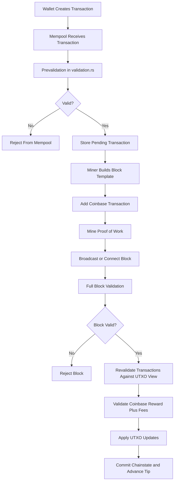

Wallet and API code may build transactions, but they are not consensus authority. `Mempool::admit` calls `validate_transaction_with_context_for_mempool`, reserves inputs, and rejects conflicts. `mining::build_candidate_block` asks the mempool for `validated_entries_for_mining`, tracks a block-local spent set, computes selected fees with checked arithmetic, creates coinbase, computes merkle and witness roots, and then the miner only searches for a nonce.

Acceptance happens later in `Chainstate::connect_block`. That function calls `validate_block_with_context` with the expected height, expected parent hash, expected target, previous blocks, and a UTXO snapshot. Only after validation succeeds does `UtxoSet::apply_block` spend inputs and create outputs. If storage commit fails, the in-memory UTXO change is disconnected with the undo record.

## 4. Transaction Validation Flow

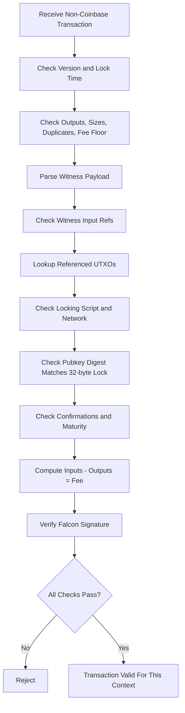

`prepare_transaction_validation_with_policy` checks version, lock time, outputs, standard output count when policy is enabled, raw and virtual size, zero outputs, duplicate inputs, minimum fee, dust when policy is enabled, witness existence, signer group ordering, input ref coverage, and short signature references. Contextual validation then looks up each UTXO, checks network and locking script equality, checks the 32-byte public-key digest, enforces maturity/confirmations, totals inputs with `checked_add`, totals outputs with `checked_output_value_atoms`, and derives the actual fee with `checked_sub`.

| Validation Step | What Code Checks | Why It Matters | Failure Result | Security Rating |
|---|---|---|---|---|
| Version | `rules::is_supported_transaction_version_with_schedule` | Prevents unknown consensus formats | `InvalidTransactionVersion` | 8 |
| Lock time | `tx.lock_time != 0 && lock_time > height` | Prevents future height spends | `InvalidLockTime` | 7 |
| Outputs | Non-empty and non-zero | Prevents malformed or zero-value txs | `NoOutputs`, `ZeroValueOutput` | 8 |
| Size | `MAX_TRANSACTION_RAW_BYTES`, `MAX_TRANSACTION_VBYTES` | Bounds DoS and fee accounting | `TransactionTooLarge` | 8 |
| Duplicate inputs | BTreeSet over previous txid/index | Prevents same-tx double spend and input-total inflation | `DuplicateInput` | 9 |
| Fee floor | `minimum_required_fee_atoms` | Anti-spam and block inclusion floor | `FeeBelowMinimum` | 8 |
| Dust | Standard policy path only | Keeps relay/mempool UTXO spam down | `DustOutput` | 7 |
| Witness parse | Exact Falcon lengths and ref count | Rejects malformed witness cheaply | `InvalidWitness` | 8 |
| UTXO lookup | `lookup(previous_txid, output_index)` | Prevents spending missing coins | `MissingUtxo` | 9 |
| Ownership | UTXO lock equals input unlock script, then pubkey digest equals lock | Prevents script_sig-only spend | `InputOwnershipMismatch` | 8 |
| Maturity | `UtxoEntry::is_spendable_at` | Enforces coinbase and standard confirmations | `InsufficientConfirmations` | 8 |
| Accounting | Checked input/output arithmetic | Prevents underflow/overflow inflation | `FeeMismatch` | 9 |
| Signature | Falcon verify over network/genesis-scoped digest | Prevents forged spends and replay | `SignatureVerificationFailed` | 8 |

## 5. UTXO Spend Validation Flow

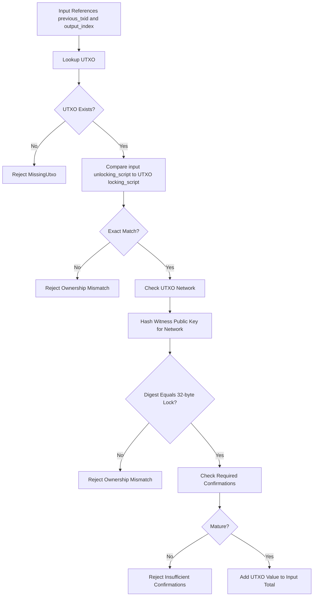

Atho does not use a Bitcoin-style script VM. The UTXO lock is fixed data. The input `unlocking_script` must equal the prior output `locking_script`; then the witness public key is hashed with `public_key_digest(network, pubkey)` and must equal that 32-byte locking script. Falcon witness verification is still required. `script_sig` cannot replace it.

Duplicate spends are blocked in multiple places:

- Same transaction: `prepare_transaction_validation_with_policy` rejects duplicate inputs.
- Same mempool: `Mempool::spent_inputs` rejects conflicting pending inputs.
- Same block: `block_inputs_are_unique` plus contextual block `seen_inputs` rejects duplicate inputs.
- Chainstate: `UtxoSet::remove` physically removes spent UTXOs during apply.

The current implementation correctly enforces fixed 32-byte UTXO locks for normal spends. The main launch risk is compatibility: genesis reward scripts are still 48 bytes in `genesis.rs`, so those outputs cannot be spent by the current 32-byte-only validator.

## 6. Falcon-512 Witness Validation Flow

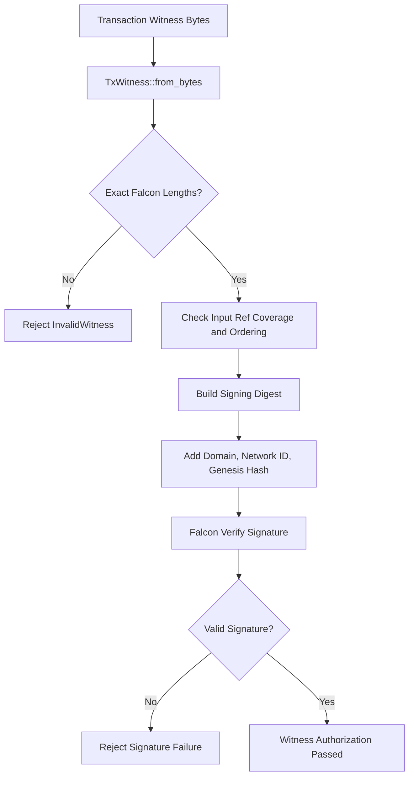

`Transaction::txid` is SHA3-384 over base bytes and excludes witness bytes. `Transaction::signing_digest` hashes base bytes plus the covered input indexes. `transaction_signing_digest` then adds the `ATHO_TX_SIGN_V1` domain, the network consensus id, and the network genesis hash before hashing again with SHA3-384. This binds signatures to network and genesis.

| Witness Rule | Current Behavior | Risk if Missing | Current Rating | Recommended Improvement |
|---|---|---|---|---|
| Signature length | `TxWitness::from_bytes` requires `FALCON_512_SIGNATURE_BYTES` | Malformed witness could reach Falcon or be truncated | 8 | Keep exact-length tests |
| Public key length | Exact `FALCON_512_PUBLIC_KEY_BYTES` | Wrong key formats could bypass or DoS | 8 | Keep malformed-key corpus |
| Network binding | Signature digest includes `network.consensus_id()` and `genesis_hash(network)` | Cross-network replay | 9 | Include ruleset id if V2 changes signing semantics |
| Input index binding | Signing digest includes covered input indexes | Cross-input witness reuse | 8 | Consider also signing prevout amount and lock explicitly |
| Output/fee binding | Base bytes include outputs and fee is derived from inputs minus outputs | Output/fee mutation theft | 8 | Add more mutation test vectors |
| UTXO amount binding | Not directly signed; protected by prevout txid/index plus UTXO lookup | Offline signer could be harder to reason about | 7 | Include previous output amount/lock in a future sighash mode |
| Witness root | Block root commits to witness signature/pubkey data | Witness mutation in blocks | 8 | Keep tests for witness root and commit refs |
| script_sig bypass | UTXO lock and Falcon are both required | Anyone-can-spend | 8 | Finish 32-byte HPK migration everywhere |

## 7. script_sig / Unlocking Reference Validation

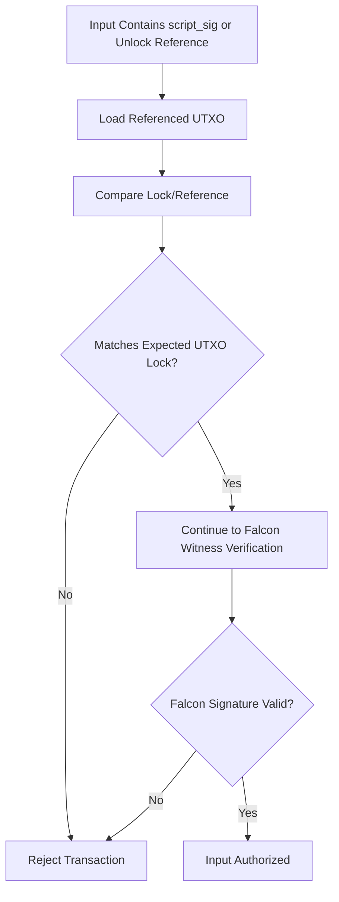

In Atho, the field named `unlocking_script` is not executable script. It is a reference/lock field. It is consensus-significant because `Transaction::update_base_hasher` includes `unlocking_script` in txid and signing digest base bytes. Changing it after signing changes the signing digest and fails Falcon verification.

Current behavior:

- `utxo.locking_script != input.unlocking_script` rejects the spend.
- `locking_script_matches_public_key` requires the lock length to be exactly `ADDRESS_DIGEST_BYTES` and equal the network-specific public-key digest.
- Falcon witness verification still runs. Matching the reference alone is not enough.

Security answer: the old unsupported-script anyone-can-spend issue is closed for normal UTXOs. The current risk is not theft; it is migration consistency. Any remaining 48-byte legacy locks become unspendable under the new 32-byte rule.

## 8. Fee and Atom Accounting Validation

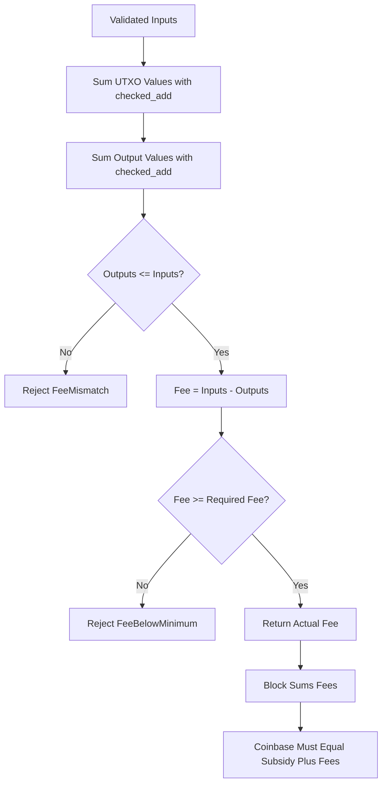

All consensus amounts are integer `u64` atoms. One ATHO is `1_000_000_000_000` atoms. Consensus validation does not use floats. Output sums and input sums use checked arithmetic. Overspending fails when `input_total.checked_sub(output_total)` returns `None`.

| Accounting Rule | Current Code Behavior | Inflation Risk | Rating | Required Fix |
|---|---|---|---|---|
| Outputs exceed inputs | `checked_sub` fails | Critical if missing | 9 | None for core path |
| Negative outputs | Impossible in `u64`; parser must reject invalid encodings | Low in Rust structs | 8 | Keep decoder fuzzing |
| Zero outputs | Rejected | Low | 8 | None |
| Dust outputs | Mempool/standard policy rejects; block consensus does not make dust a hard rule | Policy risk, not inflation | 7 | Document policy/consensus split |
| Duplicate inputs | Rejected before totals | Critical if missing | 9 | None |
| Fee underflow | `checked_sub` rejects | Critical if missing | 9 | None |
| Fee overflow in block sum | `checked_add` rejects | High if missing | 8 | None |
| Coinbase fee claim | Derived from validated tx fees, not block metadata | Critical if missing | 9 | None |
| Change output | Ordinary output; validator only checks totals and ownership on later spend | Wallet risk if wrong | 7 | Wallet tests for change ownership |
| Max money | No fixed supply cap; per-block subsidy and conservation enforce issuance | Policy mismatch if misunderstood | 8 | Keep "No Fixed Cap" docs clear |

Direct answers:

- Outputs cannot exceed inputs in contextual validation.
- Negative outputs are not representable in the Rust consensus type.
- Zero outputs are rejected.
- Duplicate inputs cannot inflate input total.
- Coinbase cannot claim more fees than locally validated transactions produce.
- No fixed max supply cap exists; security comes from per-block subsidy plus fee conservation.

## 9. Coinbase Transaction Validation

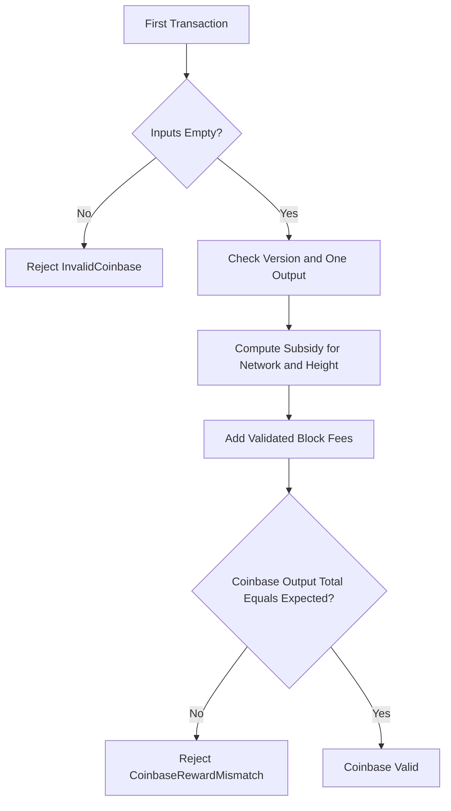

Coinbase shape is checked by `validate_coinbase_transaction_shape_with_schedule`: it must be coinbase, use a supported version, and currently have exactly one output. `validate_coinbase_transaction_with_schedule` sums outputs with checked arithmetic and requires exact equality with the expected reward.

For empty blocks, context-free validation uses subsidy only. For blocks with non-coinbase transactions, context-free validation checks coinbase shape first, then `validate_block_with_context` recomputes each transaction fee from UTXOs, sums fees, and validates:

`coinbase_output_total == block_subsidy_atoms_for_network(network, height) + sum(validated_transaction_fees)`

If this equality is not enforced, Atho would have an inflation bug. In the reviewed code, it is enforced in `validate_block_with_context_and_schedule`.

Coinbase maturity is enforced by `UtxoEntry::required_confirmations`. Coinbase outputs use `coinbase_maturity_blocks = 150`. Standard non-coinbase outputs use the network's standard confirmation setting, currently 6 on mainnet/regnet.

## 10. Monetary Policy Enforcement

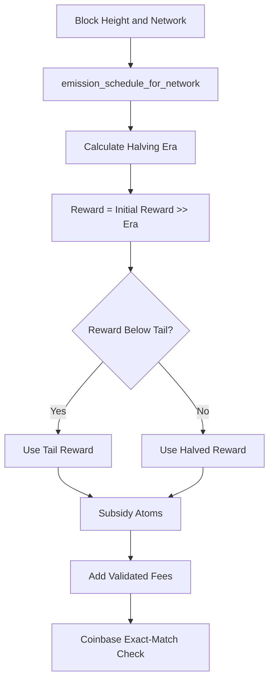

Mainnet and regnet use:

- `initial_block_reward_atoms = 5_000_000_000_000`
- `halving_interval_blocks = 1_260_000`
- `tail_reward_atoms = 625_000_000_000`
- `blocks_per_year = 315_360`
- no fixed max supply cap

Testnet and prunetest intentionally keep legacy emission constants in `emission_schedule_for_network`. This preserves testnet chain compatibility while changing mainnet/regnet.

| Monetary Rule | Enforced Where | Can Miner Bypass? | Security Rating | Recommended Fix |
|---|---|---|---|---|
| 12 decimal atoms | `constants.rs`, integer amount fields | No through consensus structs | 9 | Keep parser tests |
| 5 ATHO mainnet/regnet reward | `subsidy.rs`, block validation | No if full block validation runs | 9 | None |
| 1,260,000 halving interval | `subsidy.rs` | No | 9 | None |
| 0.625 ATHO tail | `subsidy.rs` | No | 9 | None |
| No fixed cap | `max_supply_atoms_for_network -> None` | Not applicable | 9 | Keep docs/API aligned |
| Testnet legacy schedule | `emission_schedule_for_network` | No, network-scoped | 8 | Keep cross-network tests |
| Coinbase exact reward | `validate_coinbase_transaction_with_schedule` | No | 9 | None |
| Genesis reward amount | `genesis.rs`, tests | No after genesis is fixed | 7 | Fix 32-byte script compatibility |

## 11. Block Validation Flow

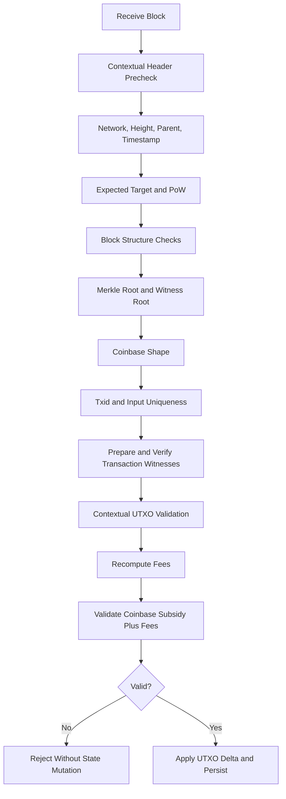

`validate_contextual_header_precheck` checks network, height, timestamp, future drift, target bounds, exact parent hash, minimum timestamp from median-time-past rules, exact expected target, and PoW against the expected target. This is important because a peer-supplied target is not trusted.

`validate_block_impl_with_schedule` then checks size, merkle root, witness root, target bounds, PoW when not skipped, coinbase shape/reward where possible, txid uniqueness, input uniqueness, transaction structure, and parallel Falcon signature verification.

`validate_block_with_context_and_schedule` runs the UTXO-aware pass, removes spent inputs from a working UTXO view, creates new outputs, checks witness commit refs, sums fees, and validates the final coinbase amount.

| Block Rule | Current Code Check | Consensus Risk if Missing | Rating | Improvement |
|---|---|---|---|---|
| Parent hash | Exact expected previous hash | Fork/link bypass | 9 | None |
| Height | Exact expected height | Reorg/index inconsistency | 9 | None |
| Network | Header network equals active network | Cross-network replay | 9 | None |
| Timestamp | Nonzero, future drift, MTP minimum | Timewarp/difficulty abuse | 7 | Expand boundary tests |
| Expected target | Header target equals locally computed target | Target spoofing | 9 | None |
| PoW | Header hash meets expected target | PoW bypass | 9 | None |
| Merkle root | Recomputed from txids | Tx mutation after mining | 9 | None |
| Witness root | Recomputed from witness commitments | Witness mutation | 8 | More adversarial tests |
| Coinbase | Shape plus exact amount | Inflation | 9 | None |
| Transactions | Revalidated independent of mempool | Invalid tx in block | 8 | Keep block/mempool matrix |
| UTXO update | Working view then apply | State corruption | 8 | More crash/reindex tests |

## 12. Mempool Validation vs Block Validation

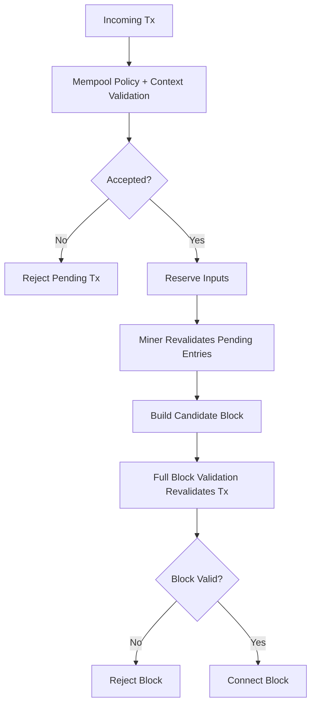

Consensus validation must not rely on "the mempool already checked it." Atho mostly follows this rule. `Mempool::admit` validates before staging. `validated_entries_for_mining` revalidates before mining selection. Full block validation revalidates transaction structure, signatures, UTXO spends, witness commit refs, fees, and coinbase reward.

| Rule | Mempool Check | Block Check | Consensus Critical? | Risk |
|---|---|---|---|---|
| Signature | Yes | Yes | Yes | Low after revalidation |
| UTXO exists/unspent | Yes | Yes | Yes | Low |
| Mempool conflict | Yes | Block uses separate input uniqueness | Policy and consensus | Low |
| Dust | Yes under standard policy | Not hard consensus | No, policy-only | Documented policy difference |
| Minimum fee | Yes | Yes | Yes/current consensus | Low |
| Size | Yes | Yes | Yes | Low |
| Coinbase | Not admitted | Block only | Yes | Low |
| Wrong network | UTXO/network checks | Header/UTXO/network checks | Yes | Low |
| Stale pending tx | Revalidated for mining | Revalidated in block | Yes | Low |

## 13. Transaction Mutation and Replay Protection

| Attack | Current Defense | Works? | Rating | Fix if Needed |
|---|---|---:|---:|---|
| Change output after signing | Outputs are in base bytes and sighash | Yes | 9 | None |
| Change fee after signing | Fee is implied by outputs and UTXOs; outputs are signed | Yes | 8 | Add more vectors |
| Change input outpoint after signing | Outpoints are in base bytes | Yes | 9 | None |
| Change unlocking_script after signing | Unlock script is in base bytes | Yes | 8 | None |
| Swap witness from another tx | Signature digest and sig refs fail | Yes | 8 | More fuzzing |
| Replace pubkey | Signature/public-key digest check fails | Yes | 8 | None |
| Replay mainnet tx on testnet | Signing digest includes network id and genesis hash | Yes | 9 | None |
| Duplicate input in tx | BTreeSet duplicate input check | Yes | 9 | None |
| Duplicate input in block | `block_inputs_are_unique` and contextual `seen_inputs` | Yes | 9 | None |
| Noncanonical encoding | Canonical byte functions define txid/signing | Mostly | 7 | More serialization corpus |
| Reuse signature on another UTXO | Outpoint and input indexes are signed | Mostly | 8 | Sign prevout amount/lock in a future mode for clearer offline safety |

Network and replay protection are strong because `transaction_signing_digest` includes the network consensus id and `genesis_hash(network)`. Cross-network block replay is also blocked by header network checks and genesis/parent identity in chainstate and sync.

## 14. Chain Selection, Reorg, and Finality Rules

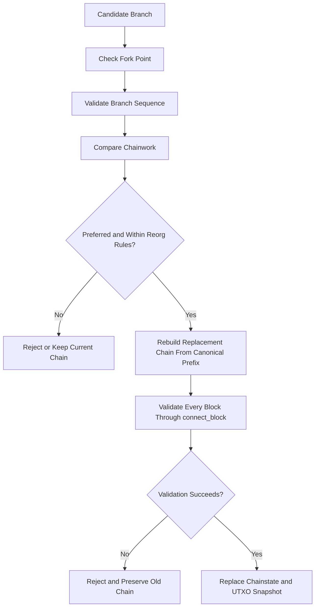

PoW branch preference helpers live in `crates/atho-core/src/consensus/pow.rs`: `accumulated_chain_work`, `compare_branch_work`, and `branch_is_preferred`. Chainstate exposes `finalized_height`, `finalized_checkpoint`, `max_reorg_depth`, and branch replacement helpers.

`replace_with_validated_branch` constructs a canonical prefix plus candidate branch, calls `validate_replacement_chain`, and only then swaps local fields and storage. This is the right shape. The major hardening target is persistence crash atomicity during `Database::replace_chainstate`, because raw block archive files are appended before the LMDB transaction is committed.

## 15. Database Persistence and Atomic State Updates

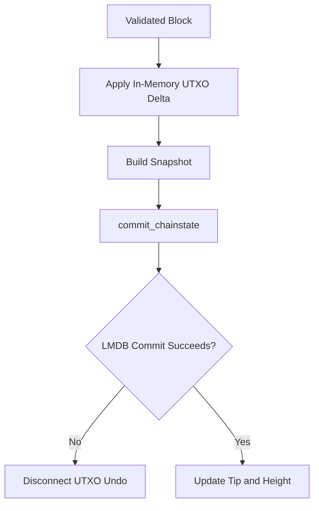

Normal block connection is reasonably safe. `Chainstate::connect_block` validates first, applies UTXO changes, and calls `Database::commit_chainstate`. If commit fails, it disconnects the in-memory UTXO delta before returning an error.

| State Update | Storage Location | Atomic? | Risk | Recommended Fix |
|---|---|---:|---|---|
| Snapshot metadata | LMDB meta | Yes | Low | None |
| UTXO delta on normal append | LMDB transaction | Yes | Low | None |
| Block indexes | LMDB transaction | Yes | Low | None |
| Raw block archive append | Block file before LMDB commit | Partially | Medium | Add staged file/commit marker recovery |
| Full chain replacement | Raw archive plus LMDB replacement | Partially | High | Make raw archive replacement crash-atomic |
| Reorg replacement | `replace_chainstate` | Partially | High | Stage, fsync, commit, then promote |
| Undo reconstruction | Storage transaction records | Mostly | Medium | Add more reindex/reorg corpus |

## 16. Consensus Security Scorecard

| Subsystem | Score 1-10 | Reason | Main Weakness | Main Improvement |
|---|---:|---|---|---|
| Transaction validation | 8 | Strong shared validator and checked accounting | Needs larger mutation corpus | Add release-gate adversarial suite |
| UTXO validation | 8 | Contextual UTXO lookup, maturity, duplicate-spend checks | Genesis 48-byte lock mismatch | Finish HPK migration |
| Falcon witness validation | 8 | Exact lengths, domain/network/genesis-scoped sighash | Prevout amount/lock not explicitly signed | Future sighash v2 |
| script_sig/reference validation | 8 | Fixed lock plus Falcon required | Legacy locks become unspendable | Regenerate/migrate genesis locks |
| Fee accounting | 9 | Fees derived from UTXOs, checked arithmetic | Dust is policy split | Document and test policy split |
| Coinbase validation | 9 | Exact subsidy plus computed fees | Needs broad fixtures | More block mutation tests |
| Monetary policy enforcement | 8 | Network-aware reward schedule and no fixed cap | Testnet legacy needs clear docs | Keep testnet isolation tests |
| Block validation | 8 | Header, PoW, target, roots, txs, UTXO, fees | Needs more large adversarial runs | 100k+ attack suite |
| PoW validation | 9 | Expected target checked locally | Needs public-network tuning | More boundary tests |
| Difficulty adjustment | 7 | MTP and bounded retarget exist | Time manipulation needs deeper tests | Timewarp/fork tests |
| Mempool safety | 7 | Revalidates and tracks conflicts | Mempool is policy, not final | Matrix tests vs block validation |
| Block template construction | 7 | Revalidates entries and checks size/fees | Template stale handling needs soak | Multi-node mining tests |
| Serialization/canonical encoding | 7 | Explicit byte layouts | Needs more parser fuzzing | Corpus roundtrip vectors |
| Replay protection | 8 | Network id and genesis in sighash | Ruleset id not in tx sighash | Include in future v2 if semantics change |
| Mutation protection | 8 | Signed base bytes cover economic fields | Witness refs complex | More witness mutation tests |
| Database atomicity | 6 | Normal append is strong; replacement weaker | Raw archive replacement not fully atomic | Staged replacement protocol |
| Chain selection/reorg | 7 | Chainwork and max reorg helpers exist | Replacement crash safety | Reorg storm and crash tests |
| Supply tracking | 8 | No fixed cap; per-block reward exact | Must avoid old cap language | Docs/API aligned now |
| Network/ruleset separation | 8 | Network-aware params and genesis | Legacy testnet paths need guard tests | Cross-network fixtures |
| Testnet/mainnet isolation | 7 | Testnet legacy schedule explicit | More accidental leakage tests needed | Network-specific regression suite |

## 17. Strengths Found

- **Single validation authority**: `validation.rs` centralizes consensus transaction and block checks. This reduces validator drift.
- **Fee metadata hardening**: block fee fields are not trusted for consensus; `derived_block_fee_atoms` and contextual validation derive fees locally.
- **Coinbase exact-match rule**: block reward cannot overpay without `CoinbaseRewardMismatch`.
- **32-byte HPK lock enforcement**: `locking_script_matches_public_key` closes unsupported-script anyone-can-spend behavior.
- **Network-scoped signatures**: transaction signatures include network id and genesis hash.
- **Checked atom arithmetic**: input/output/fee and coinbase calculations use checked operations in consensus paths.
- **Witness-separated txid**: txid excludes witness, while witness root commits to witness data in blocks.
- **Mempool is not final authority**: block validation revalidates transactions against UTXO context.
- **PoW target spoof protection**: contextual block validation compares header target to the locally expected target.
- **Chainwork helpers**: branch preference is based on accumulated work, not height alone.

## 18. Weaknesses Found

| Severity | Weakness | Where | Why It Matters | Recommended Fix |
|---|---|---|---|---|
| High | 48-byte genesis reward scripts are incompatible with 32-byte-only spend validation | `genesis.rs`, `locking_script_matches_public_key` | Prevents spending genesis reward outputs under current rules | Regenerate genesis reward scripts as 32-byte payment digests or explicitly document them as unspendable |
| High | Internal HPK decoder still expects 48-byte SHA3-384 hex | `address.rs::internal_hpk_bytes` | Conflicts with new 32-byte HPK model and can create wallet/API confusion | Update internal HPK format and tests to 32-byte digest |
| High | Full chain replacement is not fully crash-atomic across raw archive and LMDB | `db.rs::replace_chainstate` | Crash during reorg/replacement could leave orphan raw files or inconsistent recovery requirements | Stage raw files and promote only after LMDB commit or add recovery markers |
| Medium | Prevout amount and locking script are not explicitly signed | `transaction.rs::signing_digest` | Node validation is safe, but offline signer UX is less explicit | Add sighash v2 including prevout amount/lock if a future ruleset changes signing |
| Medium | Dust is standard policy, not block consensus | `prepare_transaction_validation_with_policy` | Malicious miners may include dust if minimum fee is paid | Decide if dust should remain policy-only or become scheduled consensus |
| Medium | Full 100k+ consensus adversarial campaign was not rerun in this doc update | Testing scope | Production confidence remains incomplete | Run release-gate fuzz/replay/reindex suite |
| Low | Second coinbase is rejected through non-coinbase/no-input validation rather than always a specific error | `validate_block_impl_with_schedule` | Error clarity only | Add explicit second-coinbase check for diagnostics |

## 19. Required Improvements Before Mainnet

| Priority | Improvement | Why It Matters | Files/Functions to Change | Expected Security Gain |
|---:|---|---|---|---|
| 1 | Finish 32-byte HPK migration for genesis and internal HPK strings | Prevents unspendable genesis outputs and format confusion | `genesis.rs`, `address.rs`, wallet/address tests | High |
| 2 | Make `replace_chainstate` crash-atomic with raw block archives | Prevents reorg/replacement persistence edge cases | `db.rs::replace_chainstate`, recovery tests | High |
| 3 | Run full replay/reindex/UTXO-root verification after monetary-policy changes | Proves the new reward schedule replays deterministically | storage and node tests | High |
| 4 | Add release-gate block mutation tests | Proves mined blocks reject every committed mutation | `validation.rs` tests, fixtures | High |
| 5 | Add mempool-vs-block validation matrix tests | Prevents miner/mempool policy drift | `mempool.rs`, `validation.rs`, node tests | Medium |
| 6 | Add timewarp and difficulty boundary tests for 100-second mainnet/regnet | Protects difficulty schedule | `pow.rs`, `validation.rs` | Medium |
| 7 | Add address/HPK replay fixtures across mainnet/testnet/regnet | Protects network separation | `address.rs`, `validation.rs` | Medium |
| 8 | Add long-running multi-node sync and reorg soak | Catches stalls and state drift | `sync.rs`, node integration | Medium |
| 9 | Add parser and serialization fuzz corpus | Hardens malformed transaction/block handling | `transaction.rs`, `block.rs`, P2P codecs | Medium |
| 10 | Decide whether dust remains policy-only | Avoids surprise miner behavior | `validation.rs`, docs | Medium |

## 20. Production Readiness Summary

Overall security score: **7/10**

Consensus readiness score: **7/10**

Monetary policy enforcement score: **8/10**

Transaction validation score: **8/10**

Block validation score: **8/10**

UTXO safety score: **8/10**

Coinbase safety score: **9/10**

Mainnet readiness status: **Close but not ready**

Must-fix before mainnet:

- Complete 32-byte HPK migration for genesis and internal HPK paths.
- Make full chain replacement crash-atomic across raw archive and LMDB.
- Run full release-gate adversarial, replay, reindex, reorg, and long-soak tests on the exact mainnet branch.
- Verify all mainnet/regnet docs, API endpoints, whitepaper, benchmark output, release notes, and node status endpoints report 5 ATHO, 100 seconds, 1,260,000 halvings, 0.625 tail, 6 confirmations, and no fixed cap.

Should-fix:

- Add prevout amount/lock to a future signed transaction digest mode if the project wants stronger offline-signer guarantees.
- Add explicit second-coinbase error handling.
- Expand storage corruption and reindex tests.
- Keep testnet legacy schedule clearly isolated and documented.

Final recommendation: Atho's current validation core is much stronger than it was before the unsupported-script fix. Locking/unlocking is no longer an anyone-can-spend risk for normal 32-byte HPK outputs, transaction validation preserves atom accounting, block validation rejects overpaying coinbase transactions, and monetary policy is enforced in the block acceptance path. I would not call it production mainnet-ready yet, because launch safety depends on finishing the 32-byte HPK migration, proving storage replacement recovery, and running the full adversarial/replay suite on the final branch.

Top 10 things to understand:

1. Atho has no general script VM; fixed UTXO locks plus Falcon witness authorization are the spend rule.
2. A valid spend needs the UTXO, the exact unlocking reference, a 32-byte public-key digest match, maturity, and a valid Falcon signature.
3. Txids exclude witness data; block witness roots commit to witness data.
4. Signatures are network/genesis scoped, which is the main cross-network replay defense.
5. Fees are not trusted from block metadata; they are recomputed from UTXOs.
6. Coinbase reward must equal network subsidy plus recomputed fees.
7. Mainnet/regnet now have no fixed cap and use 5 ATHO, 100 seconds, 1,260,000 halvings, and 0.625 ATHO tail.
8. Testnet intentionally keeps legacy monetary/timing settings.
9. The 32-byte-only HPK rule is secure, but all legacy 48-byte locks must be migrated or treated as unspendable.
10. The remaining mainnet blockers are engineering proof and edge-case hardening, not an obvious active inflation or anyone-can-spend bug in the reviewed path.
