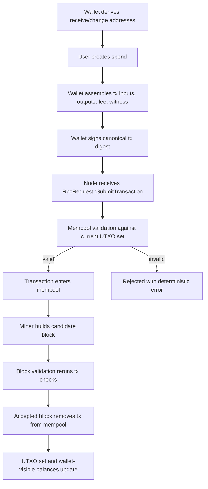
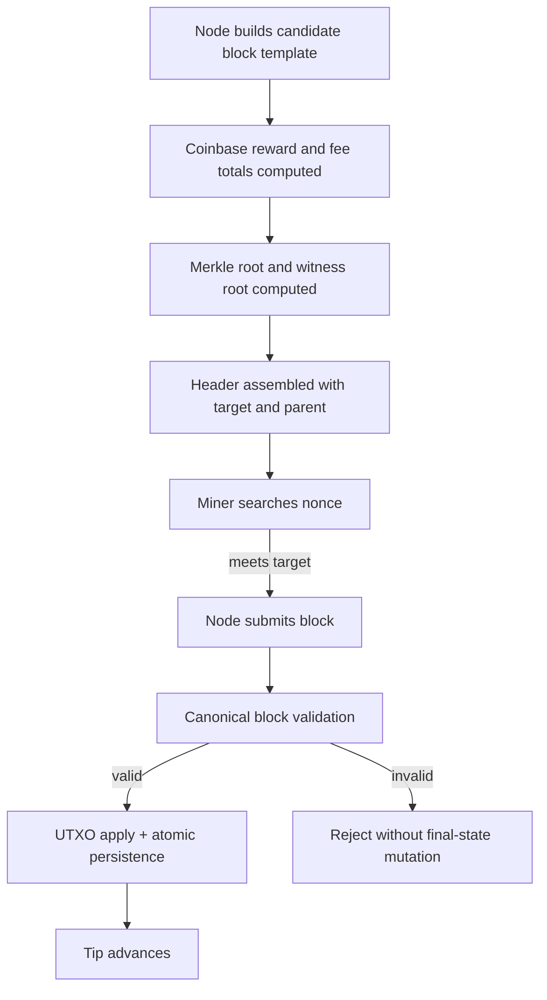
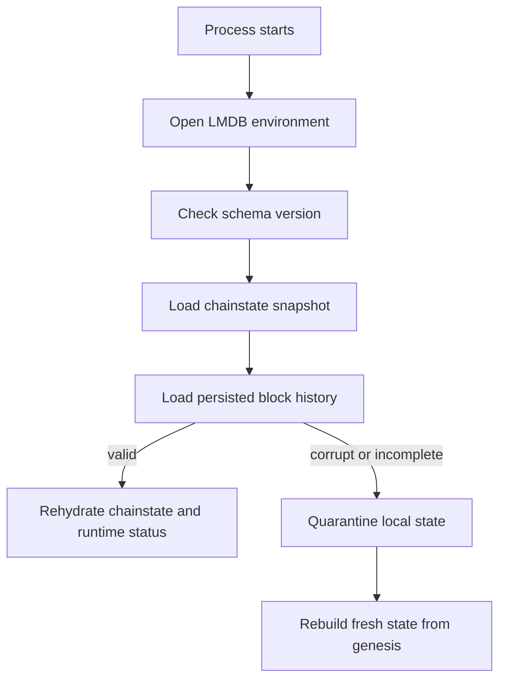
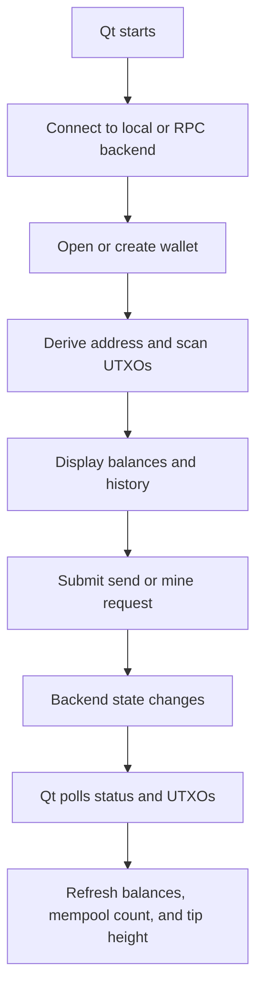
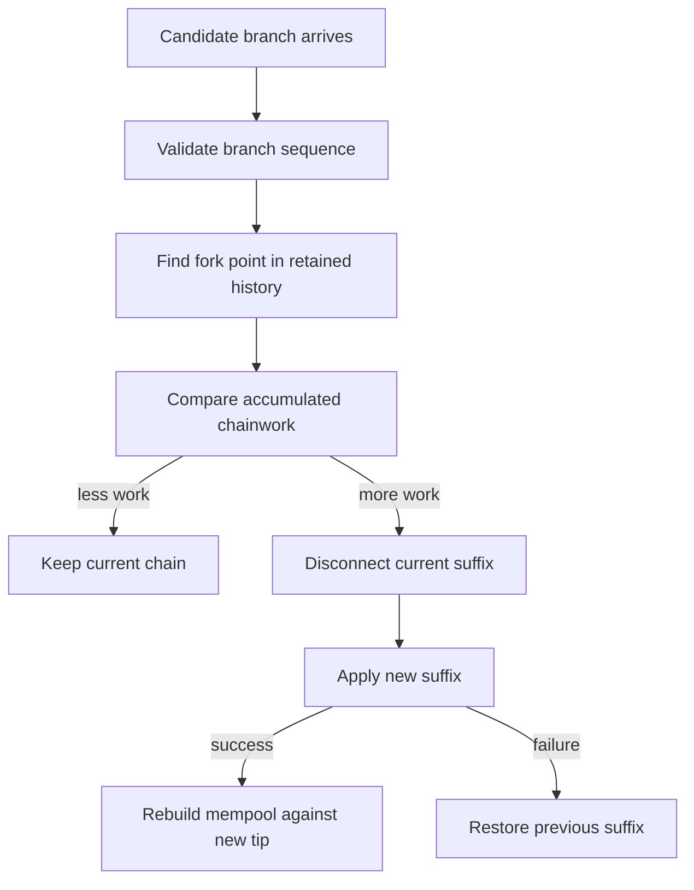

# Lifecycle Flows

This document summarizes the major end-to-end flows that define how Atho behaves at runtime.

## Transaction Lifecycle

Why it is shaped this way:

- transaction creation stays wallet-owned
- transaction acceptance stays node-owned
- transaction validity is checked again at block-accept time
- mempool policy and block consensus share the same underlying validation logic

## Block Lifecycle

Why it is shaped this way:

- miners do not bypass validation
- block acceptance is separate from block construction
- persistence happens only after validation passes

## Restart And Reload Lifecycle

Why it is shaped this way:

- fail-closed is safer than silent partial recovery
- quarantine preserves forensic context without trusting damaged state

## Wallet And Qt Lifecycle

Why it is shaped this way:

- the GUI remains stateless relative to consensus truth
- chain tip and balances are refreshed from backend reality

## Reorg Lifecycle

Why it is shaped this way:

- invalid competing history must not contaminate final state
- rollback and reapply need to be deterministic

## Related Documentation

- [Transactions](../protocol/transactions.md)
- [Blocks and Consensus](../protocol/blocks-and-consensus.md)
- [Wallet Model](../wallet/wallet-model.md)
- [Qt Client](../gui-client/qt-client.md)
