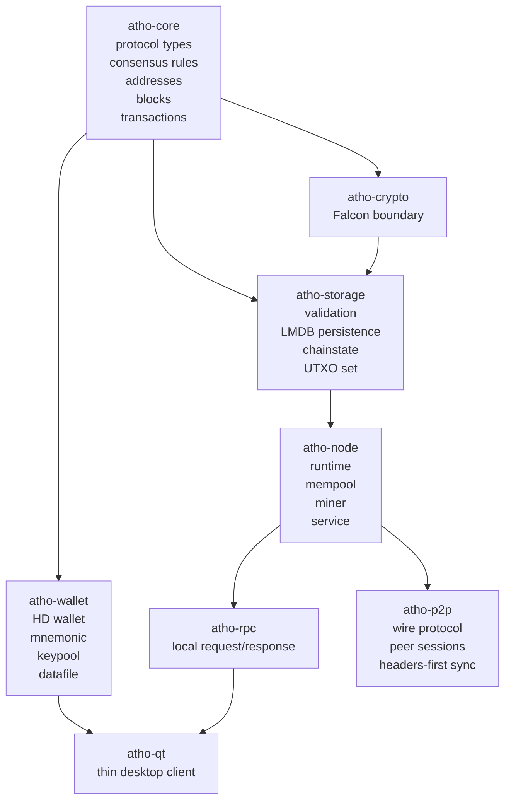
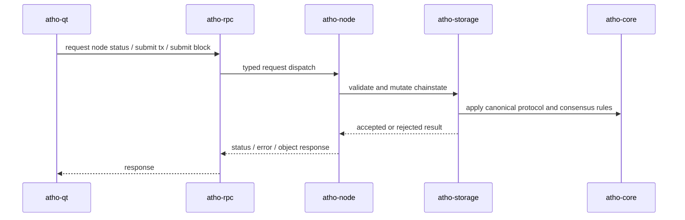

# System Architecture

## Overview

Atho uses a layered, Bitcoin-style architecture:

- protocol and consensus at the bottom
- validation and storage directly above them
- node runtime and mining above storage
- RPC as the boundary between backend and client
- Qt as a thin desktop client

The core rule is simple:

The backend owns truth. The GUI renders truth.

## High-Level Diagram

## Subsystem Roles

### `atho-core`

Owns the frozen protocol surface:

- network identities
- transaction and block encoding
- address rules
- genesis data
- version constants
- consensus parameter functions

Why:

- consensus-critical code should have the smallest reasonable dependency surface

### `atho-storage`

Owns:

- canonical block and transaction validation
- chainstate transitions
- UTXO apply/disconnect
- atomic chainstate persistence
- local corruption quarantine and recovery

Why:

- chain acceptance and state mutation need one authority path

### `atho-node`

Owns:

- runtime lifecycle
- mempool
- mining
- RPC mutable operations
- orchestration of sync, storage, and runtime status

Why:

- the node should own live operational state, not the GUI or RPC library

### `atho-wallet`

Owns:

- seed material
- derivation
- address generation
- keypool behavior
- wallet state capture/restore
- encrypted wallet datafiles

Why:

- wallet policy and secrets need a separate boundary from the node

### `atho-p2p`

Owns:

- network parameters
- message framing
- handshake rules
- peer address bookkeeping
- headers-first synchronization state

Why:

- networking complexity should not leak into consensus code

### `atho-rpc`

Owns:

- request/response types
- small server state model
- JSON-over-TCP transport

Why:

- a thin RPC surface keeps the desktop client and external automation decoupled from internal node structs

### `atho-qt`

Owns:

- UI pages and dialogs
- wallet UX orchestration
- status polling
- send/mining interactions through backend interfaces

Why:

- it should remain a client, not a second node

## Runtime Interaction Model

## Design Tradeoffs

### Chosen

- small crates with explicit ownership
- one canonical validation owner
- UI-over-RPC instead of embedded UI chainstate ownership
- local storage as the authority for persisted state

### Deferred

- live TCP peer runtime completion
- compact block relay
- snapshot sync
- canonical wallet history API

Those deferred items are acknowledged as product gaps rather than hidden complexity.

## Related Documentation

- [Lifecycle Flows](lifecycle-flows.md)
- [Chainstate and Persistence](../storage/chainstate-and-persistence.md)
- [Node Runtime and P2P](../node-runtime/node-runtime-and-p2p.md)
