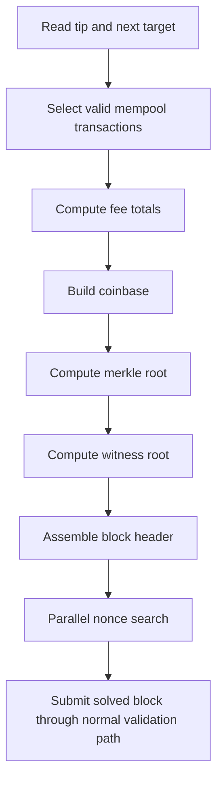

# Mining and Mempool

## Mempool Purpose

The mempool is the node’s validated, in-memory staging area for candidate transactions.

Implemented in:

- `crates/atho-node/src/mempool.rs`

## Mempool Rules

The mempool:

- validates transactions against current chainstate
- rejects duplicates
- tracks spent-input conflicts
- orders candidates by feerate, then fee, then txid
- revalidates after accepted blocks and reorgs

Why:

- mempool policy must remain aligned with chainstate without becoming a second consensus system

## Mining Purpose

Mining turns the current best chain tip and valid transaction set into a candidate block and then searches for a valid nonce.

Implemented in:

- `crates/atho-node/src/miner.rs`

## Mining Flow

Why:

- mined blocks should never skip the same validation path external blocks use

## Coinbase Handling

The miner:

- calculates subsidy from height
- adds allowed fees
- can rotate the payout address if the GUI requests it

Why:

- coinbase construction is a consensus-sensitive path and should be owned by backend logic, not UI code

## Parallelization

The nonce search uses Rayon worker threads and a progress monitor.

Why:

- nonce search is embarrassingly parallel
- validation and storage are kept separate from the search loop

Current caution:

- mining progress logging is still more verbose than a hardened production path should be

## Reorg Interaction

After accepted blocks or branch changes:

- mined or invalidated mempool entries are removed
- remaining entries are revalidated against the new UTXO view

Why:

- mining candidates should always reflect the active best chain

## Current Limitations

- no compact-block relay path for newly found blocks
- no long-running mining soak documented as production-safe yet
- no networked miner pool protocol

## Related Documentation

- [Transactions](../protocol/transactions.md)
- [Blocks and Consensus](../protocol/blocks-and-consensus.md)
- [Qt Client](../gui-client/qt-client.md)
