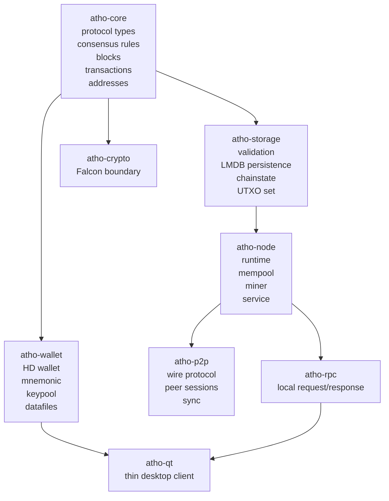

# About Atho

> Atho's slogan is: **The Platinum Standard for the Quantum Age**

## What This Page Is

This page is the long-form, website-style introduction to Atho.

It is written for readers who want a single place to understand:

- what Atho is
- why Atho exists
- how the codebase is organized
- how the node, wallet, client, and network fit together
- what the current project posture is
- what is already implemented
- what is still unfinished
- how the release and packaging flow works

It is intentionally broader than a normal quickstart guide and more approachable than a narrow protocol specification. If the repository has many detailed subsystem documents, this page is the map that ties them together.

## Website-Friendly Outline

If this page is turned into a website, this is the recommended order:

1. Hero and slogan
2. What Atho is
3. What Atho is not
4. Why Atho exists
5. Network identity and parameters
6. Base56 address encoding
7. Consensus shape
8. Execution and optimization model
9. Falcon-512 implementation
10. UTXO, wallet, node, P2P, RPC, and GUI roles
11. Release and packaging story
12. Performance, hardening, and current status
13. FAQ and glossary

That order follows the way a reader usually thinks:

- first the name and purpose
- then the network and address model
- then consensus and execution
- then the cryptography and runtime layers
- then the delivery and release story

## Atho At A Glance

| Topic | Summary |
| --- | --- |
| Project type | Rust blockchain payment stack |
| Ledger model | Public UTXO chain |
| Validation model | Local full validation, backend-owned truth |
| Consensus style | Proof-of-work chain with explicit versioning |
| Hash family | SHA3-256 and SHA3-384 |
| Signature scheme | Falcon-512 |
| Primary binaries | `athod`, `atho-mine`, `atho-qt` |
| Wallet model | HD wallet with encrypted datafiles |
| Client model | Thin desktop client over RPC |
| Delivery model | Native installer front-end plus release bundles |
| Design posture | Deterministic, compact, explicit, auditable |
| Practical throughput | About 80 TPS on small 1-in/1-out transactions |

## The Slogan

The slogan is:

**The Platinum Standard for the Quantum Age**

That spelling matters.

The phrase is intentionally aspirational. It is not a consensus rule, and it does not replace the protocol specification. It is a compact way of describing the project’s intended character:

- **Platinum** means the project is trying to hold itself to a high, durable, high-integrity standard.
- **Standard** means the system should be boring, explicit, and repeatable rather than flashy or ambiguous.
- **Quantum Age** means the project is built with long-lived cryptographic thinking and post-quantum readiness in mind.

The slogan is not saying that Atho is magical, future-proof, or done. It is saying that the project aims to be careful about long-term security assumptions and disciplined about implementation quality.

## What Atho Is

Atho is a Rust blockchain payment stack with a compact UTXO-based operational shape.

In practical terms, that means:

- it uses a public UTXO ledger
- it keeps chain validity local and deterministic
- it validates transactions and blocks through explicit rules
- it stores chainstate durably
- it exposes a thin desktop client instead of a second chain implementation
- it separates the node, wallet, network, and GUI layers instead of merging them into one blob

Atho is not trying to be a general app platform. It is not trying to be a smart-contract framework first. It is not trying to be a privacy chain by default. It is trying to be a compact, auditable payment network with a clear trust model.

## What Atho Is Not

Atho is deliberately not:

- a general-purpose Layer 1 application VM
- a “everything blockchain” platform
- a GUI-owned consensus system
- a wallet that invents its own truth separate from the backend
- a protocol that hides rules inside runtime magic
- a build that depends on developer-only paths or scripts

That restraint is important. A lot of blockchain software becomes hard to audit because it starts mixing product scope with consensus scope. Atho’s current design keeps those boundaries visible.

## The Core Idea

The core idea behind Atho is simple:

1. define the protocol explicitly
2. validate every consensus-relevant object on one canonical path
3. store chain truth durably
4. keep the GUI thin
5. keep the operator model boring
6. let the node own truth and let the client render it

That principle shows up everywhere in the repository:

- in the protocol types
- in the transaction and block encoders
- in the chainstate model
- in the wallet datafile
- in the RPC boundary
- in the Qt UI
- in the release and installer system

## Base56 Address Encoding

Atho uses Base56 for human-facing payment addresses.

Important detail: Base56 is not the hash primitive. It is the text encoding layer used to render address payloads in a human-readable form.

The address pipeline is:

1. derive a payment digest from the public key, network tag, and role label
2. encode that digest into Base56
3. prepend the visible network prefix
4. compute a checksum from the prefix and body with SHA3-256
5. render the checksum as 6 Base56 characters

That design is used for:

- user-facing payment addresses
- visible network separation
- checksum-based transcription error detection
- deterministic decoding back to the underlying digest

The internal hashed-public-key form is separate from the visible address form:

- visible address: Base56 with a network prefix and checksum
- internal key id: hex text with `ATHO` or `ATHT` prefix

That separation makes the product easier to reason about:

- users see short, network-marked addresses
- the backend keeps a stable key-oriented identity string for ownership and scripting

## Why Atho Exists

Atho exists because a blockchain stack becomes much easier to reason about when it is built with a few hard constraints:

- one canonical validation owner
- one canonical chainstate owner
- one canonical wallet persistence model
- one canonical network identity model
- one thin client boundary
- one obvious release flow

That is the same discipline found in mature full-node software. Atho borrows that operational philosophy while choosing its own hashing, signing, and packaging decisions.

## The Architecture In One View

The important point is not the diagram itself. The important point is the ownership model:

- `atho-core` owns protocol shape
- `atho-storage` owns validation and durable chainstate
- `atho-node` owns runtime behavior
- `atho-wallet` owns keys and wallet persistence
- `atho-p2p` owns network transport and peer session logic
- `atho-rpc` owns typed backend communication
- `atho-qt` owns the desktop interface
- `atho-installer` owns the native installer front end

That split is what keeps the project auditable.

## The Repository As A Product

Atho is not just code. It is also a product system:

- source crates
- operational docs
- release staging
- installer front ends
- native desktop bundles
- checksums and manifests
- benchmark reports
- adversarial test harnesses
- launch checklists

This matters because a blockchain project does not ship only through consensus code. It ships through launch, update, recovery, and operator experience.

## The Crate Map

| Crate | Responsibility | Why It Exists |
| --- | --- | --- |
| `atho-core` | Protocol types, constants, blocks, transactions, consensus math | Keeps consensus-critical state small and explicit |
| `atho-crypto` | Falcon boundary and secret-handling boundary | Keeps cryptographic integration separate from business logic |
| `atho-storage` | Validation, chainstate, LMDB persistence, UTXO apply/disconnect | Owns durable truth and the canonical validation path |
| `atho-wallet` | HD wallet, mnemonic, keypool, encrypted datafiles | Separates user secrets from chain consensus |
| `atho-p2p` | Framing, handshake, peer/session logic, sync scaffolding | Keeps network transport isolated from validation logic |
| `atho-rpc` | Typed requests, responses, transport | Keeps the client/backend boundary clean |
| `atho-node` | Runtime, mempool, miner, service orchestration | Owns live node behavior |
| `atho-qt` | Desktop UI and wallet client | Renders backend truth without redefining it |
| `atho-installer` | Native installer front end | Gives users a real app-style installation flow |

## What The Project Feels Like

Atho is intended to feel like production software, not like a developer experiment.

That means:

- a user downloads an installer
- the installer verifies what it is about to install
- the app opens like a normal desktop app
- the backend node starts or connects safely
- the GUI shows state from the backend
- the wallet operates through the node instead of substituting for it
- the operator can inspect logs, status, and network health

That experience is a deliberate product goal.

## How A User Experiences Atho

The intended flow is:

1. download Atho from a release page
2. run the installer
3. choose an install location if needed
4. let the installer place the app and helper commands
5. open Atho from the desktop or Applications folder
6. let the client start the local node or attach to the backend
7. wait for sync and wallet readiness
8. create, open, import, send, receive, and monitor funds through the UI

This is the same mental model users expect from a normal desktop wallet application.

## How Atho Starts

The startup model is explicit:

- validate the packaged resources
- load config
- check the data directory
- detect whether a backend node is already running
- start the node if necessary
- wait for API readiness
- show progress in the UI
- open the main dashboard when the backend is ready

That sequence is important because startup bugs often feel like product bugs even when the underlying code is technically correct.

## The Runtime Shape

Atho has three primary operator-facing binaries:

1. `athod`
2. `atho-mine`
3. `atho-qt`

They are designed for different roles:

- `athod` is the full node and validation daemon
- `atho-mine` is the dedicated miner client
- `atho-qt` is the desktop wallet and operator interface

The project is intentionally not trying to make every binary do everything.

## How The Stack Executes

Atho executes as a layered stack, and the layers are arranged so the hot path stays narrow.

At a high level, the runtime flow looks like this:

1. the launcher resolves the platform-specific bundle and writable data directory
2. the node loads config, chainstate, wallet state, and peer state
3. the RPC and P2P layers expose the backend only after readiness checks pass
4. the mempool accepts or rejects transactions on the canonical validation path
5. the miner assembles blocks from validated mempool entries
6. the storage layer applies or disconnects blocks atomically
7. the Qt client renders backend truth and never replaces it

That means the stack is not trying to guess its own state. It is always reading from the backend, and the backend is always the source of truth.

The execution path is also deliberately staged:

- decode first
- validate structure second
- check network and ruleset context third
- perform UTXO and maturity checks in batches
- verify Falcon signatures with exact domain separation
- commit or reject atomically

That staging matters because it keeps expensive work off the wrong path and keeps state transitions deterministic.

## Where Speed Comes From

Atho’s speed work is not about skipping checks. It is about doing the right checks in the right order and only repeating work when the inputs actually change.

The current speed strategy includes:

- validate once on mempool admission, then reuse exact safe results when a block contains the same bytes
- batch UTXO reads and writes so the database sees one staged apply instead of per-transaction churn
- parallelize Falcon-512 verification for independent inputs
- cache sighash and signature results only when the network, ruleset, message, and key context are exact
- prefer compact relay and headers-first sync to reduce bandwidth waste
- use low-copy parsing where possible so the node does not repeatedly reserialize the same bytes
- keep the GUI thin so the UI does not become part of consensus or storage work
- invalidate caches aggressively on reorgs, restarts, and context changes

The performance goal is safe throughput, not speculative speed. A fast node that sometimes trusts stale state is worse than a slower node that stays correct.

The practical execution model is:

1. a transaction arrives
2. the mempool decodes and validates it
3. the transaction is cached only if its exact bytes and exact signature context are known
4. a miner or validator later reuses that cached work only if the context still matches
5. the node rechecks the chainstate before it finalizes anything

That is how Atho gets speed without turning the fast path into a hidden consensus fork.

## Network Identity

Atho currently defines three networks:

| Network | Internal ID | CLI tag | P2P Port | RPC Port |
| --- | --- | --- | ---: | ---: |
| Mainnet | `atho-mainnet` | `mainnet` | `56000` | `9010` |
| Testnet | `atho-testnet` | `testnet` | `9100` | `9110` |
| Regnet | `atho-regnet` | `regnet` | `9200` | `9210` |

Every network has:

- a hardcoded genesis identity
- a wire magic value
- a visible address prefix
- a one-byte consensus identifier
- distinct ports

That is how Atho prevents cross-network confusion.

## Network Parameters

Atho treats network identity as a fixed part of the protocol, not a launch-time guess.

The network object carries the identity values that everything else keys off of:

- internal network name
- CLI/network tag
- consensus identifier
- network magic
- default P2P port
- default RPC port
- visible address prefix
- internal HPK prefix
- UTXO flag
- DNS seed list
- protocol version bounds

| Parameter | Mainnet | Testnet | Regnet |
| --- | --- | --- | --- |
| Internal ID | `atho-mainnet` | `atho-testnet` | `atho-regnet` |
| CLI tag | `mainnet` | `testnet` | `regnet` |
| Consensus ID | `1` | `2` | `3` |
| Network magic | `a7 54 48 01` | `a7 54 48 02` | `a7 54 48 03` |
| P2P port | `56000` | `9100` | `9200` |
| RPC port | `9010` | `9110` | `9210` |
| Visible address prefix | `A` | `T` | `R` |
| Internal HPK prefix | `ATHO` | `ATHT` | `ATHT` |
| UTXO flag | empty | `TEST-UTXO` | `REG-UTXO` |
| DNS seeds | none | none | none |

Accepted CLI aliases are:

- `mainnet` or `atho-mainnet`
- `testnet` or `atho-testnet`
- `regnet`, `regtest`, or `atho-regnet`

The current transport rules are shared across all three networks and are documented in code so they stay explicit:

| P2P limit | Value |
| --- | ---: |
| Max message size | `8 MiB` |
| Max addresses per message | `1,000` |
| Max inventory items per message | `50,000` |
| Max headers per message | `2,000` |
| Max blocks in flight | `128` |
| Max requests per peer | `256` |
| Handshake timeout | `5s` |
| Read timeout | `10s` |
| Write timeout | `10s` |
| Max inbound peers | `32` |
| Max outbound peers | `8` |
| Max peers per IP | `8` |
| Max peers per subnet | `16` |
| Max known peers | `4,096` |
| Max user agent bytes | `256` |
| Ban score threshold | `100` |
| Peer decay interval | `60s` |

The active protocol version is carried in `PROTOCOL_VERSION`, and the minimum supported protocol version is `1`.

Those limits are part of the network safety envelope. They keep the wire protocol bounded so the node can stay deterministic under load and reject oversized or abusive traffic early.

## Consensus In Plain Language

Atho consensus is built around the idea that a block or transaction is valid only if it satisfies the same deterministic rules on every node that runs the same ruleset.

That means:

- a transaction must have correct encoding
- a transaction must have valid signatures
- a transaction must spend real unspent outputs
- a block must link to the right parent
- a block must satisfy proof of work
- a block must fit the size limits
- a block must have a valid merkle root and witness root
- coinbase reward math must be correct
- the current ruleset and network identity must match

The project keeps those rules in code so they are visible and testable.

## The Current Consensus Shape

The current documented consensus shape in this repository is:

- block time target: 75 seconds
- block cap: 3,000,000 vbytes
- raw cap: about 12,000,000 bytes
- transaction model: SigWit-style witness-separated sizing
- signature scheme: Falcon-512
- address model: public UTXO
- practical throughput target: about 65-80 TPS depending on transaction mix
- small common transaction size: about 500 vbytes for a 1-in/1-out spend
- rough block capacity at 500 vbytes: about 6,000 transactions per block
- rough throughput at 75-second blocks and 500 vbyte transactions: about 80 TPS

That is a compact but modern payment-chain shape.

## Blocks

Blocks bundle:

- a header
- a transaction list
- a merkle root
- a witness root
- fee accounting totals
- proof-of-work metadata

The header commits to:

- version
- network
- height
- previous block hash
- merkle root
- witness root
- timestamp
- target
- nonce

That keeps the chain identity explicit and auditable.

## Transactions

Atho transactions are UTXO spends with:

- version
- inputs
- outputs
- lock time
- witness bytes

Transactions are designed to be:

- integer-only
- canonically serialized
- size-bounded
- signature-checked
- witness-aware
- deterministic to hash and validate

The validation path checks:

- version support
- size limits
- duplicate inputs
- fee floor
- witness shape
- signature validity
- UTXO existence
- UTXO ownership
- maturity rules

## Witnesses And Falcon-512

Atho uses Falcon-512 for signatures, and the repository keeps the integration details explicit instead of hiding them behind a generic crypto wrapper.

The key sizes are fixed by the current wrapper:

| Item | Size |
| --- | ---: |
| Public key | `897 bytes` |
| Secret key | `1,281 bytes` |
| Signature | `666 bytes` |

The signature system is domain-separated so different parts of the product cannot silently reuse the same signature context.

| Domain | Frozen label | Typical use |
| --- | --- | --- |
| Transaction | `ATHO_TX_SIGN_V1` | Transaction signing and verification |
| Block | `ATHO_BLOCK_SIG_V1` | Reserved for block-signature use |
| Wallet local | `ATHO_WALLET_LOCAL_SIG_V1` | Local wallet-only signing |
| Package | `ATHO_PACKAGE_SIG_V1` | Packaged-release integrity contexts |
| Test dev | `ATHO_TEST_DEV_SIG_V1` | Test-only development contexts |

The signing rules are also versioned:

- `ATHO_SIGNATURE_RULES_VERSION = 1`
- transaction signing prehash uses canonical `Transaction::base_bytes()`
- transaction signing prehash hash function is `SHA3-384`
- block signing prehash uses canonical block header bytes
- block signing prehash hash function is `SHA3-384`
- both signing and verification use `DomainContext(label.as_bytes())`
- both signing and verification use `HASH_ID_SHA3_384`

In other words:

1. a transaction is reduced to its canonical base bytes
2. those bytes are hashed with SHA3-384
3. the hash is signed inside a frozen Atho domain label
4. verification replays the same domain and hash rules

That gives Atho a clean message-binding model: a valid signature only means something inside the exact domain, on the exact message, with the exact key.

The crypto wrapper also behaves safely in the face of malformed input:

- invalid public-key or signature lengths fail closed
- decode failures return `false` rather than panicking
- deterministic key generation can be driven from a seed for tests and reproducible flows
- OS randomness is used for normal key generation and signing
- seed material and secret material are zeroized where practical

The deterministic seed path matters because it lets the project create repeatable test vectors without changing the production signing model.

The security consequence is simple:

- transaction signatures cannot be reused as wallet-local signatures
- package signatures cannot be mistaken for transaction signatures
- test-only signatures cannot leak into consensus behavior
- changed bytes, changed domains, or changed keys must force a new verification result

The repository also includes performance work so signature verification can be batched and cached safely without weakening consensus checks. Speed is a goal, but only when the message binding stays exact.

## UTXO State

The UTXO set is the authoritative accounting layer.

The node and storage layers treat UTXO state as the source of truth for:

- spendability
- ownership
- maturity
- balance calculation
- rollback/reorg restoration

That is one reason Atho remains easier to reason about than an account-global mutation model. Each output is a concrete unit of value and spendability.

## Chainstate And Persistence

Atho uses durable local persistence to protect against restart, recovery, and rollback ambiguity.

The storage layer owns:

- block archive
- transaction archive
- UTXO apply/disconnect
- chain tip updates
- chainstate snapshots
- peer and address metadata
- corruption quarantine and recovery flows

The node should never have to guess about whether a block was accepted.

## Mining

Mining is separate from validation.

The miner:

- asks the node for a candidate template
- selects mempool transactions by fee rate
- respects dependencies and spent-set logic
- fills the block up to the current consensus limit
- searches for a valid nonce

Why keep it separate:

- miners should not bypass validation
- validation should not depend on mining heuristics
- the node should accept only blocks that pass full consensus checks

## The Mempool

The mempool is a policy and staging layer.

It exists so that:

- valid transactions can be accepted before block inclusion
- invalid transactions can be rejected early
- miners can prioritize by fee rate
- the node can reconcile chain changes against pending transactions

The mempool is not consensus truth. It is a fast, local staging area that must still obey the same validity rules as blocks.

## The Network Layer

Atho’s network layer currently includes:

- network parameters and limits
- framed binary messages
- handshake and version checks
- peer address tracking
- ban scoring
- inventory and relay logic
- headers-first synchronization scaffolding

The network layer is intentionally bounded and message-driven:

- small set of message types
- explicit network identity
- length-prefixed binary framing
- hard bounds on message sizes and counts

That keeps the project honest about what the network is for: transporting the chain, not redefining it.

## The Desktop Client

The Qt client is the user-facing window into the backend.

It is responsible for:

- wallet creation and import
- wallet opening
- send and receive workflows
- transaction history display
- network and status diagnostics
- mining controls
- local node startup in managed mode

It is not responsible for:

- block validation
- UTXO truth
- consensus logic
- chain preference decisions

That separation is why the GUI can be both useful and thin.

## The Installer And Release Story

Atho’s release story is meant to feel like normal software delivery.

The repository currently builds:

- native installers
- macOS app bundles
- Windows client launchers
- platform archives
- checksums and manifests
- shareable desktop release trees

The release packaging aims to make the app feel like a normal download:

- Windows users get an installer and `Atho.exe`
- macOS users get a DMG or app bundle and `Atho.app`
- the package verifies embedded payload integrity
- the installed app opens as a real desktop client

That is the difference between “source tree tooling” and “shipping software.”

## What Makes Atho Boring On Purpose

Boring is a compliment in a blockchain stack.

Atho tries to be boring in the parts that must never surprise you:

- consensus rules
- storage writes
- block validation
- UTXO transitions
- wallet persistence
- startup and restart behavior
- release packaging
- network identity

This kind of boredom is what gives operators confidence.

## Security And Hardening

The repository has been hardened with:

- consensus tests
- lifecycle tests
- reorg and restart tests
- adversarial mutation campaigns
- fuzz targets for parsers and validators
- sandbox benchmark runs
- release packaging checks

The hardening philosophy is simple:

- validate once
- revalidate on boundary crossings
- keep caches exact
- invalidate on state changes
- never trust one fast path to stand in for consensus

## Performance And Parallelism

Atho is not just about correctness. It also cares about performance.

The project has explicit work on:

- mempool prevalidation
- validation batching
- Falcon verification parallelism
- UTXO read/write batching
- compact relay
- header-first sync
- zero-copy or low-copy parsing where safe

The goal is not raw speed for its own sake. The goal is safe throughput that still keeps validation deterministic.

The current throughput expectation is:

- small 1-in/1-out transactions: about 500 vbytes
- 3,000,000 vbyte blocks: about 6,000 such transactions per block
- 75-second block time: about 80 TPS at that size profile

That is a target range, not a promise that every transaction mix will land on the same number. Larger transactions reduce throughput, and the system is designed to stay honest about that.

## What The Project Feels Like Today

Today Atho feels like a disciplined project that is beyond prototype stage but still finishing the public-facing rough edges.

That means:

- the local architecture is strong
- the wallet and client path are usable
- the node and storage path are meaningful
- the release pipeline exists
- the public-network story is still being hardened

That honesty matters. A project becomes safer when it documents what is done and what is not done.

## Current Strengths

The strongest parts of Atho today are:

- canonical validation
- durable storage
- restart and recovery behavior
- local wallet and node lifecycle
- RPC-driven client behavior
- explicit network identity
- test coverage for core operations
- release and installer structure

## Current Gaps

The remaining major gaps are still:

- peer-served snapshot sync
- deeper pruning coverage
- schema migration breadth
- long-run public-network soak coverage
- OS-level GUI automation
- active post-V1 rule execution
- broader release hardening for signing and notarization

None of those are hidden. They are documented as work still to do.

## How To Use Atho Today

If you want to run Atho as a user, the intended flow is:

1. install from a release bundle
2. open the desktop client
3. let the client start or connect to the backend
4. wait for sync and wallet readiness
5. create, open, or import a wallet
6. send and receive through the GUI

If you want to run Atho as an operator, the intended flow is:

1. run `athod` on the target network
2. configure or monitor the data directory
3. keep RPC private
4. expose P2P when appropriate
5. use `atho-qt` or `atho-mine` as needed

## How To Think About The Repo

If you are new to the repository, the easiest mental model is:

- `crates/atho-core`: what the chain is
- `crates/atho-storage`: how truth is validated and stored
- `crates/atho-node`: how the backend runs
- `crates/atho-wallet`: how keys and wallet state work
- `crates/atho-p2p`: how peers talk
- `crates/atho-rpc`: how the backend exposes typed requests and responses
- `crates/atho-qt`: how the user interacts with the backend
- `crates/atho-installer`: how Atho is delivered to a machine

That division is the whole project in one paragraph.

## Subsystem Deep Dive

### `atho-core`

`atho-core` is the protocol bedrock.

It owns the types and rules that everything else builds on:

- network identities
- block headers and body shapes
- transaction encoding
- address formats
- proof-of-work constants
- subsidy and halving logic
- signature domains
- genesis data

If `atho-core` changes, the change should feel rare and deliberate. That is the point of having a small consensus core.

### `atho-storage`

`atho-storage` is where protocol truth becomes durable state.

It owns:

- transaction validation
- block validation
- UTXO application and rollback
- chainstate snapshots
- durable block and transaction archives
- local recovery and quarantine behavior

This crate is the boundary between “valid according to the rules” and “persisted as the chain’s actual local truth.”

### `atho-node`

`atho-node` is the live operating system for the backend.

It owns:

- runtime startup and shutdown
- mempool admission and reconciliation
- block template construction
- mining support
- RPC handling
- P2P orchestration
- live status reporting

It is the crate that turns the protocol into a running node.

### `atho-wallet`

`atho-wallet` is the user’s key and address system.

It owns:

- mnemonic handling
- HD derivation
- keypool management
- address book state
- encrypted wallet datafiles
- recovery window behavior

The wallet is intentionally separate from consensus so that wallet UX and chain truth do not collapse into each other.

### `atho-p2p`

`atho-p2p` is the transport and synchronization layer.

It handles:

- framed binary messages
- version and handshake checks
- address gossip
- inventory relay
- headers-first sync scaffolding
- peer quality and ban scoring

Its job is not to define validity. Its job is to move data safely between nodes that already agree on the protocol.

### `atho-rpc`

`atho-rpc` defines the backend interface boundary.

It exists so the desktop client, miner, and operator tooling can talk to the node through typed requests and responses rather than direct struct sharing.

### `atho-qt`

`atho-qt` is the user-facing client.

It provides:

- launch and startup screens
- overview dashboard
- send and receive flows
- wallet creation and import flows
- transaction history
- settings and diagnostics
- mining controls

Its job is to keep the UI fast, readable, and subordinate to backend truth.

### `atho-installer`

`atho-installer` is the delivery front end.

It exists to make Atho install like normal software:

- native app bundle on macOS
- installer executable on Windows
- packaged release flow with checksums and manifests

The installer is not supposed to be a developer script. It is supposed to be the front door for a real user.

## User Journeys

### First-Time User

A first-time user should see a simple path:

1. download Atho
2. verify the release checksum
3. install the app
4. open the app
5. wait for the backend to start
6. create or open a wallet
7. sync and use the network

The user should not need to know what a crate is, what a ruleset is, or what a LMDB environment is.

### Operator

An operator should see a different path:

1. run `athod`
2. choose the right network
3. point at the correct data directory
4. monitor status and logs
5. manage peers and relay
6. mine or relay as appropriate

For operators, Atho should feel predictable and inspectable.

### Developer

A developer should see:

- a clean workspace layout
- explicit crate ownership
- reproducible build and release scripts
- clear docs for protocol, runtime, and packaging
- tests that are easy to run in sandbox mode

The repo is trying to make the “right thing” obvious for each role.

## What Happens During A Normal Launch

The normal launch path is worth spelling out because it explains why the client feels the way it does.

1. the launcher checks packaged resources
2. the launcher resolves the correct app resource path
3. the launcher locates the writable data directory
4. the launcher checks whether a backend is already running
5. the launcher starts the node if needed
6. the backend opens the RPC health endpoint
7. the GUI waits for readiness rather than pretending everything is ready immediately
8. the wallet scan and state refresh begin
9. the dashboard becomes usable

That sequence is intentional. It reduces the chance that the user is looking at stale or fictional state.

## What Happens When Things Go Wrong

Good blockchain software does not just succeed. It fails in ways the operator can understand.

Atho tries to surface failure in a few obvious categories:

- missing binary
- bad config
- database locked
- wrong network
- port already in use
- permission denied
- startup error
- backend disconnected
- unsynced or stale status

That is the right failure vocabulary for a node and desktop client. When a system hides these classes of error, users end up guessing.

## Delivery And Release Story

The release system is part of the product.

Atho’s release flow includes:

- versioned release directories
- direct installer assets
- platform archives
- checksums
- manifests
- shareable desktop trees
- macOS app bundles
- Windows client launchers

That means a release is not just “some binaries in a folder.” It is a repeatable package with a clear installation story.

## What A Website Page About Atho Should Emphasize

If this page were turned into a public-facing website page, the emphasis should stay on:

- what Atho is
- why Atho exists
- how Atho feels to a user
- what the architecture looks like
- what makes the chain deterministic
- how the wallet and client fit together
- how the release process works
- what is done and what is still being built

The page should avoid sounding like marketing fluff with no technical center. Atho is a software project first.

## Glossary

| Term | Meaning |
| --- | --- |
| UTXO | Unspent transaction output, the basic unit of spendable value |
| Chainstate | The local authoritative view of the chain tip, UTXOs, and related metadata |
| Mempool | The staging area for valid but unconfirmed transactions |
| Witness | Signature and reference material carried separately from base transaction data |
| Ruleset | The active consensus rule selection for a height range |
| Node | The backend process that validates and serves the chain |
| Client | The desktop interface that talks to the node |
| Bootstrap peer | A known peer used to seed live P2P connectivity when DNS seeds are not available |
| Reorg | A chain branch switch after a higher-work branch becomes preferred |
| Pruning | Removing or reducing historical data that is not needed for current operation |
| Keypool | Pre-derived wallet addresses kept ready for fast allocation |
| Recovery window | The address discovery window used when reconstructing a wallet from seed or backup |

## The Character Of The Project

Atho’s character is best described as:

- explicit
- compact
- deterministic
- backend-owned
- auditable
- product-minded
- release-conscious
- operator-friendly

That combination is the real project identity, more than any one algorithm choice or one UI screen.

## A Simple Launch Story

The most important user story is still the simplest one:

1. the user launches Atho
2. the app validates the bundle and config
3. the local node starts or connects
4. the client waits for readiness
5. the dashboard appears
6. the wallet scans and updates from real backend state

If that story works, the project feels real.

## A Simple Validation Story

The most important consensus story is equally simple:

1. decode a transaction or block
2. check canonical form
3. verify the right signatures
4. check the UTXO state
5. apply the rule set
6. accept or reject deterministically

If that story works, the chain is understandable.

## A Simple Release Story

The most important delivery story is also simple:

1. build release artifacts
2. generate checksums
3. stage a native installer
4. package a self-contained client
5. publish the release
6. let users install without touching source code

If that story works, the project feels like product software.

## Frequently Asked Questions

### Is Atho meant to be a clone of another chain?

No.

Atho borrows the operational discipline of mature full-node software and a UTXO-based accounting model, but it has its own codebase, its own hash choices, its own signature scheme, its own network identity, and its own packaging story.

### Why use Rust?

Because memory safety, explicit ownership, and performance matter in consensus software.

### Why Falcon-512?

Because Atho is trying to think about long-lived cryptographic assumptions and post-quantum readiness rather than treating signatures as a disposable implementation detail.

### Why is the GUI thin?

Because the GUI should show backend truth, not invent its own chainstate.

### Why are DNS seeds blank?

Because the live public-network bootstrap story is still being hardened and manual peer bootstrap remains part of the current operator model.

### Is Atho production-ready?

Not fully yet.

The repository’s own status docs place the project beyond prototype stage but still short of a complete public-network production launch.

## Where To Read Next

If this page gives you the high-level map, the next best places to read are:

- [Project Overview](project-overview.md)
- [System Architecture](../architecture/system-architecture.md)
- [Blocks and Consensus](../protocol/blocks-and-consensus.md)
- [Network and Identity](../protocol/network-and-identity.md)
- [Transactions](../protocol/transactions.md)
- [Wallet Model](../wallet/wallet-model.md)
- [Qt Client](../gui-client/qt-client.md)
- [Node Runtime and P2P](../node-runtime/node-runtime-and-p2p.md)
- [Runtime Model](../operations/runtime-model.md)
- [Build and Packaging](../build-deployment/packaging.md)
- [Current Production Status](../production-readiness/current-status.md)
- [Testing and Hardening](../testing-audits/testing-and-hardening.md)

## Closing Perspective

Atho’s best version is not the loudest version.

Its best version is a system where:

- consensus is explicit
- storage is durable
- the client is thin
- the wallet is understandable
- the network is bounded
- the release process is reproducible
- the operator can see what is happening
- the user does not need to touch the terminal

That is the project’s long-term shape.

The slogan captures the ambition, but the codebase is what must earn it:

**The Platinum Standard for the Quantum Age**
