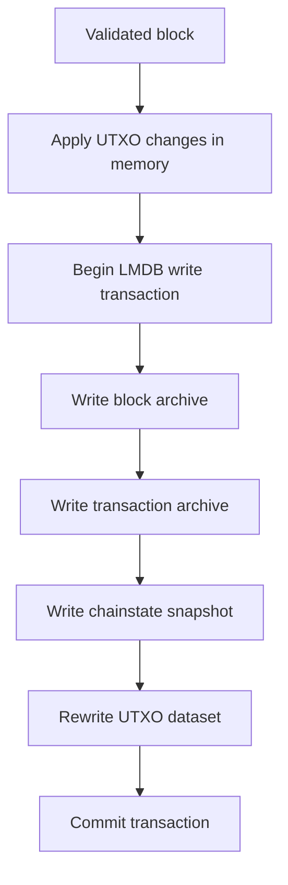

# Chainstate and Persistence

## Purpose

The storage layer owns the durable local truth of the Atho node.

It is responsible for:

- canonical chainstate snapshots
- block and transaction archives
- UTXO persistence
- reorg-safe rollback data
- corruption detection
- local recovery and quarantine

## Storage Layout

Implemented in:

- `crates/atho-storage/src/db.rs`
- `crates/atho-storage/src/chainstate.rs`
- `crates/atho-storage/src/path.rs`

Current durable storage uses one LMDB environment per network with named databases:

- `meta`
- `blocks`
- `transactions`
- `utxos`
- `peers`
- `addresses`

Why:

- a single environment supports atomic multi-dataset commits
- named databases keep subsystem boundaries explicit without scattering state across independent stores

## Atomic Commit Model

When a new best-chain block is accepted, Atho commits:

1. block archive record
2. transaction archive records
3. chainstate snapshot
4. full serialized UTXO snapshot

inside one LMDB write transaction.

Why:

- partial persistence is worse than explicit failure
- block acceptance should not appear durable unless all related state is durable

## Chainstate Snapshot

The canonical snapshot contains:

- height
- tip hash
- optional tip header

Why:

- the node needs a compact restart anchor
- full replay from serialized history should remain possible, but normal restart should be fast

## UTXO Persistence Model

The persisted UTXO set is keyed by:

- transaction id
- output index

Each entry stores:

- network
- txid
- output index
- value in atoms
- locking script
- creation height
- coinbase flag

Implemented in:

- `crates/atho-storage/src/utxo.rs`

Why:

- UTXO state must be network-local and maturity-aware

## Recovery And Quarantine

If local persisted state is:

- corrupt
- incomplete
- cross-network inconsistent
- schema-mismatched

the storage layer can:

- quarantine the affected local files under `quarantine/`
- emit a `RECOVERY.txt`
- rebuild state from genesis

Why:

- fail-closed plus quarantine is safer than silent best-effort repair

## Data Roots

Current data-root logic:

- if `ATHO_DATA_DIR` is set, use it as the sandbox root
- otherwise, use `./dev`

Derived subpaths:

- `db/`
- `chain/`
- `quarantine/`

Why:

- sandboxed local runs need predictable, isolated state

Current limitation:

- the default still depends on the current working directory when `ATHO_DATA_DIR` is unset

## Chain Exports

The `dev/chain/` area contains TSV exports for debugging and audit visibility.

Important:

- those exports are operational aids
- they are not the canonical persisted source of chain truth

Why:

- human-readable audit outputs are useful, but consensus must not depend on them

## Current Limitations

- no schema migration framework yet
- no offline repair/reindex tool beyond quarantine and rebuild
- pruning-depth recovery is conservative

## Related Documentation

- [Consensus Rules](../consensus/consensus-rules.md)
- [Reorg, Fork, and Pruning Rules](../consensus/reorg-fork-pruning.md)
- [Dev Workspace](../operations/dev-workspace.md)
