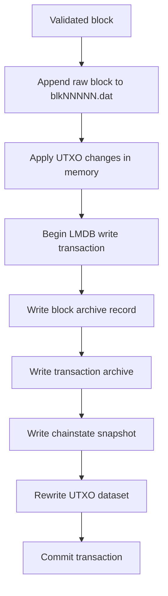

# Chainstate and Persistence

## Purpose

The storage layer owns the durable local truth of the Atho node.

It is responsible for:

- canonical chainstate snapshots
- block and transaction archives
- UTXO persistence
- reorg-safe rollback data
- corruption detection
- local recovery and quarantine

## Storage Layout

Implemented in:

- `crates/atho-storage/src/db.rs`
- `crates/atho-storage/src/chainstate.rs`
- `crates/atho-storage/src/path.rs`

Current durable storage is hybrid:

- full raw blocks live in Bitcoin-style flat files under `<network>/blocks/`
- LMDB stores chainstate snapshots, block metadata, block indexes, tx indexes, UTXOs, and peer/address metadata

Why:

- raw blocks are large append-only archival objects
- indexed state and chain metadata need fast random access and atomic updates

The LMDB environment per network still uses named databases:

- `meta`
- `blocks`
- `block_heights`
- `block_transactions`
- `transactions`
- `utxos`
- `peers`
- `addresses`
- `peer_health`

## Atomic Commit Model

When a new best-chain block is accepted, Atho:

1. appends the canonical raw block bytes to the active `blkNNNNN.dat`
2. writes the block archive record to LMDB
3. writes the transaction archive records to LMDB
4. writes the chainstate snapshot to LMDB
5. rewrites the canonical UTXO dataset in LMDB

The LMDB portion is one write transaction. The flat-file append happens first, and
the stored file number, offset, and payload length are committed with the rest of
the block metadata.

Why:

- partial persistence is worse than explicit failure
- block acceptance should not appear durable unless all related state is durable

## Chainstate Snapshot

The canonical snapshot contains:

- height
- tip hash
- optional tip header

Why:

- the node needs a compact restart anchor
- full replay from serialized history should remain possible, but normal restart should be fast

## UTXO Persistence Model

The persisted UTXO set is keyed by:

- transaction id
- output index

Each entry stores:

- network
- txid
- output index
- value in atoms
- locking script
- creation height
- coinbase flag

Implemented in:

- `crates/atho-storage/src/utxo.rs`

Why:

- UTXO state must be network-local and maturity-aware

## Recovery And Quarantine

If local persisted state is:

- corrupt
- incomplete
- cross-network inconsistent
- schema-mismatched

the storage layer can:

- quarantine the affected local files under `quarantine/`
- emit a `RECOVERY.txt`
- rebuild state from genesis

Why:

- fail-closed plus quarantine is safer than silent best-effort repair

Production recovery rule:

- all networks use the same recovery code path
- recoverable local chainstate/index damage is quarantined under the active network's data root
- rebuilt state always starts from the active network's genesis and configuration
- unrecoverable corruption still fails closed with a clear error

Testnet development rule:

- testnet may reset during development

This keeps recovery network-aware without making mainnet, testnet, and regnet drift into separate storage behavior.

## Data Roots

Current data-root logic:

- if `ATHO_DATA_DIR` is set, use it as the explicit Atho runtime root
- otherwise, use an OS-native Atho application directory

Default root by platform:

- macOS: `~/Library/Application Support/Atho`
- Linux: `${XDG_DATA_HOME:-~/.local/share}/Atho`
- Windows: `%APPDATA%\\Atho`

Derived subpaths:

- `db/<network>/`
- `db/<network>/blocks/`
- `chain/`
- `quarantine/`

Why:

- operators need a stable data location by default
- developers still need an explicit override for disposable sandbox runs

## Chain Exports

The `chain/` area contains legacy TSV snapshots and debug/audit exports only.

Important:

- those exports are quarantine/debug artifacts
- they are not loaded by the production runtime
- if the runtime sees them during startup, it treats them as legacy layout input
  and quarantines them instead of replaying them live

Why:

- human-readable audit outputs are useful, but consensus must not depend on them
- the active runtime path should be unambiguous after the storage migration

## Current Limitations

- schema migration coverage is still narrow
- no offline repair/reindex tool beyond quarantine and rebuild
- pruning-depth recovery is conservative

## Related Documentation

- [Consensus Rules](../consensus/consensus-rules.md)
- [Reorg, Fork, and Pruning Rules](../consensus/reorg-fork-pruning.md)
- [Dev Workspace](../operations/dev-workspace.md)
