# Atho: A Post-Quantum Proof-of-Work Payment Network for the Quantum Age

**Subtitle:** Digital Platinum for Quantum-Secure Public Settlement

**Project:** Atho

**Tagline:** The Platinum Standard of the Quantum Age

**Version:** Draft v1.0

**Date:** April 30, 2026

**Author or Organization:** Atho Labs / Atho Project Team

**Website:** https://atho.io

**Contact:** genull@proton.me

\pagebreak

# Abstract

Atho is a post-quantum, proof-of-work, public UTXO payment blockchain designed for long-term settlement infrastructure. The project addresses a practical problem faced by public ledgers: value transfer systems must remain independently verifiable while preparing for cryptographic risk from future quantum computers. Atho uses a public UTXO accounting model, local full-node validation, proof-of-work block production, SHA3-family hashing, and Falcon-512 transaction signatures. Its implementation is written in Rust and separated into crates for protocol types, validation and storage, cryptography, wallet state, peer networking, RPC, node runtime, desktop UI, and installation. This paper explains Atho's architecture, transaction model, block structure, proof-of-work and mining flow, monetary policy, wallet design, Base56 address encoding, storage model, network synchronization, security assumptions, performance posture, testing strategy, and roadmap. It distinguishes Atho-specific implementation decisions from external cryptographic and systems facts, citing NIST post-quantum cryptography materials, Falcon documentation, Rust documentation, SHA3 standardization, and proof-of-work literature where appropriate. The central design claim is that Atho should be evaluated not as a general application platform but as a compact settlement network whose rules are explicit, auditable, and suitable for durable public payment infrastructure in a quantum-aware cryptographic environment.

**Keywords:** Atho, post-quantum cryptography, Falcon-512, proof-of-work, public UTXO, blockchain, Rust, SHA3, payment network, digital platinum, quantum security

\pagebreak

# Table of Contents

- Executive Summary
- 1. Introduction
- 2. Problem Statement
- 3. Atho Design Principles
- 4. System Overview
- 5. Protocol Architecture
- 6. Rust Implementation Strategy
- 7. Cryptographic Design
- 8. Falcon-512 Implementation in Atho
- 9. Transaction Model
- 10. UTXO and Accounting Rules
- 11. Block Structure
- 12. Proof-of-Work and Mining
- 13. Monetary Policy and Emissions
- 14. Mempool Design
- 15. Consensus Validation
- 16. Network Layer
- 17. Storage Layer
- 18. Wallet Architecture
- 19. Address and Encoding Design
- 20. API and Developer Tooling
- 21. Explorer and Indexer
- 22. Security Model
- 23. Performance and Scalability
- 24. Testing, Auditing, and Benchmarking
- 25. Governance and Upgrade Philosophy
- 26. Roadmap
- 27. Conclusion
- References
- Appendices

# List of Figures

- Figure 1. Atho System Overview
- Figure 2. Atho Node Architecture
- Figure 3. Atho Transaction Signing and Verification Flow
- Figure 4. Transaction Lifecycle
- Figure 5. Block Validation Pipeline
- Figure 6. Atho Emission Model
- Figure 7. Mempool Admission Flow
- Figure 8. Node Sync and Block Propagation Flow
- Figure 9. Wallet-to-Node Interaction
- Figure 10. Validation Pipeline and Parallel Work Distribution
- Figure 11. Hybrid Storage Commit Model

# List of Tables

- Table 1. Why Rust Fits Atho Core Infrastructure
- Table 2. Falcon-512 Validation Failure Cases
- Table 3. UTXO Validation Rules
- Table 4. Mining Components and Responsibilities
- Table 5. Monetary Policy Constants
- Table 6. Consensus-Critical Invalid Cases
- Table 7. Address Design Tradeoffs
- Table 8. Atho Threat Model
- Table 9. Required Test Coverage Matrix
- Table 10. Rust Safety Requirements for Atho Consensus Code
- Table 11. Code Reference Map

# Executive Summary

Atho is a Rust-based public payment blockchain designed around post-quantum transaction signatures, proof-of-work consensus, transparent issuance, and local full validation. Its stated product identity is "The Platinum Standard of the Quantum Age," but the technical claim of this paper is narrower and more important: Atho attempts to build durable public settlement by keeping the consensus surface compact, deterministic, auditable, and owned by the backend node rather than by a wallet interface or hosted service.

Public settlement matters because a payment network is only as credible as the ability of independent participants to verify the ledger. In Atho, transactions spend explicit unspent transaction outputs, blocks commit to ordered transaction and witness data, and local nodes validate every accepted block against the same deterministic rule path. This resembles the general proof-of-work settlement model introduced by Nakamoto (2008), but Atho makes different implementation choices: SHA3-family hashing, Falcon-512 transaction signatures, Base56 addresses, Rust crates with narrow responsibilities, and a thin Qt client that renders node-owned truth instead of redefining it.

The post-quantum direction is central. NIST has finalized FIPS 203, FIPS 204, and FIPS 205 for post-quantum cryptography, and Falcon has been selected for standardization as FN-DSA in the future FIPS 206 track (National Institute of Standards and Technology [NIST], 2024a, 2024b). Atho uses Falcon-512 today for transaction authorization. The project therefore treats quantum-era signature risk as a design constraint rather than a later migration topic. This does not mean that Atho is immune to every future cryptographic or implementation problem. It means that the current signing model is deliberately built around a NIST-selected post-quantum signature family rather than around a classical elliptic-curve signature scheme.

Atho also differs from hype-driven cryptocurrency projects by limiting its Layer 1 scope. It is not positioned as a general-purpose application VM or an "everything chain." The repository emphasizes canonical validation, durable LMDB-backed chainstate, explicit network identity, transparent monetary constants, release packaging, and practical wallet/node workflows. The long-term vision is a payment settlement network that is ordinary in operation, difficult to confuse, straightforward to audit, and prepared for a cryptographic environment in which long-lived public ledgers cannot assume classical digital signatures remain sufficient indefinitely.

# 1. Introduction

Atho is a post-quantum, proof-of-work, public UTXO payment blockchain built for long-term settlement rather than for broad application execution. The project is written in Rust and organized as a set of purpose-specific crates: `atho-core` for protocol types and consensus constants, `atho-storage` for validation and durable chainstate, `atho-crypto` for the Falcon boundary, `atho-wallet` for deterministic wallet state, `atho-p2p` for peer transport, `atho-rpc` for local typed backend calls, `atho-node` for runtime behavior, `atho-qt` for the desktop client, and `atho-installer` for release installation. This separation is not cosmetic. It is the mechanism by which Atho attempts to keep consensus-critical code auditable and product-facing code thin.

The purpose of Atho is to provide simple, verifiable money infrastructure for public settlement. A durable payment chain must make it possible for a local node to decide whether a transaction spends real value, whether a block extends the best valid chain, whether the coinbase reward is correct, and whether the current network and ruleset match the object being processed. Atho therefore keeps the node as the owner of truth. The wallet creates keys, addresses, and transactions; the GUI presents state; the miner searches for blocks; but the node and storage validation path decide what is accepted.

This white paper exists to consolidate the technical model into a single publication-style document. It uses the internal Atho documentation and source code as the authority for Atho-specific values and uses external references for general claims about post-quantum cryptography, Falcon, Rust, SHA3, proof-of-work, and APA formatting. Where the repository does not currently define a value, the paper marks the value as TBD rather than inventing protocol behavior. That distinction is important for a blockchain system because undocumented assumptions can become accidental consensus rules.

# 2. Problem Statement

Payment blockchains face a combined security, usability, and longevity problem. They must allow public verification while resisting double spends, invalid issuance, hostile peers, malformed input, wallet errors, database failures, and software upgrades that accidentally split validators. At the same time, they must remain usable enough that wallets, miners, and operators can run the system without relying on a hidden trusted service. Atho addresses that problem by narrowing its scope to public settlement and by treating independent node validation as the fundamental product feature.

The cryptographic problem is especially important for long-lived ledgers. Shor (1997) showed polynomial-time quantum algorithms for integer factorization and discrete logarithms, the mathematical foundations of many widely deployed classical public-key systems. NIST's post-quantum cryptography project was created because future quantum computers could threaten current public-key cryptography and because migration takes years of planning (NIST, 2024b). A public blockchain exposes authorization data on a public record. Once a transaction reveals the public key or signature material needed for verification, that material remains available for future analysis. A chain intended for long-term settlement should therefore consider quantum-era signature risk before deployment, not after funds have accumulated under legacy assumptions.

The operational problem is equally concrete. A payment network cannot depend on a GUI that owns consensus state, a wallet that trusts its own local balance without backend validation, or a miner that bypasses full block checks. Payment chains need efficient validation so ordinary nodes can participate, simple monetary rules so issuance can be audited, and practical wallet and node software so the network can be operated by real users. Atho's design goal is to balance usability, security, scalability, and decentralization by reducing protocol complexity before adding product breadth.

# 3. Atho Design Principles

Atho's first design principle is public settlement first. The chain is meant to record value transfers that can be verified by independent nodes. Every design choice is subordinate to that model: transactions are UTXO spends, blocks commit to transaction and witness roots, network identity is explicit, and wallet state is derived from backend-confirmed chain data. The result is a system that prioritizes verifiability over general-purpose runtime expressiveness.

The second principle is quantum-resistant transaction authorization. Atho uses Falcon-512 as its active transaction signature scheme through a dedicated wrapper in `crates/atho-crypto/src/falcon.rs`. NIST selected Falcon as one of the post-quantum digital signature algorithms to be standardized, and NIST's current public material identifies the future standard as FN-DSA/FIPS 206 (NIST, 2022, 2024b). Atho's use of Falcon is an implementation choice; Falcon's general security claims come from the external cryptographic literature and standardization process, not from Atho itself.

The third principle is simple and auditable UTXO accounting. Each output is a concrete unit of spendable value. Spending consumes prior outputs and creates new outputs. Fees are derived from the difference between input total and output total. Coinbase outputs have maturity constraints. Reorg rollback restores spent outputs and removes created outputs. This model does not eliminate complexity, but it keeps value transitions local and explicit.

Other principles follow from those foundations: proof-of-work security, transparent monetary policy, efficient validation, minimal protocol complexity, developer-ready infrastructure, long-term maintainability, and security before feature bloat. Atho's restraint is intentional. A compact settlement system can be tested, audited, packaged, and operated more rigorously than a broad runtime whose consensus behavior is spread across many feature domains.

# 4. System Overview

The Atho system is composed of users, wallets, transactions, mempool policy, miners, blocks, full nodes, peer propagation, APIs, storage, and optional explorer or indexer software. A user interacts with a wallet or desktop client. The wallet derives addresses from mnemonic or seed material, selects spendable UTXOs, constructs a transaction, signs the canonical transaction digest with Falcon-512, and submits the transaction to the node through RPC or peer propagation. The node then validates the transaction against structure, witness, fee, UTXO, ownership, and maturity rules before admitting it to the mempool.

Miners ask the node for candidate block material. The miner selects validated mempool transactions, constructs a coinbase paying the current subsidy plus allowed miner fees, computes merkle and witness roots, and searches for a nonce that satisfies the current target. A solved block is not accepted merely because the local miner produced it. It must pass the same validation path as an externally received block. This prevents the mining implementation from becoming a shortcut around consensus.

Full nodes persist accepted chain truth through a hybrid storage model. Canonical raw block bytes are archived in Bitcoin-style flat block data files, while LMDB stores block metadata, block indexes, transaction archives, chainstate snapshots, UTXOs, peers, addresses, and peer health. The storage layer writes new raw blocks to network-specific `blkNNNNN.dat` files and commits the indexed state changes through LMDB so ordinary metadata queries do not need to reopen raw block files. APIs and explorer-like consumers can read from the node and storage products, but they do not become consensus authorities. Figure 1 summarizes the transaction-to-settlement path.

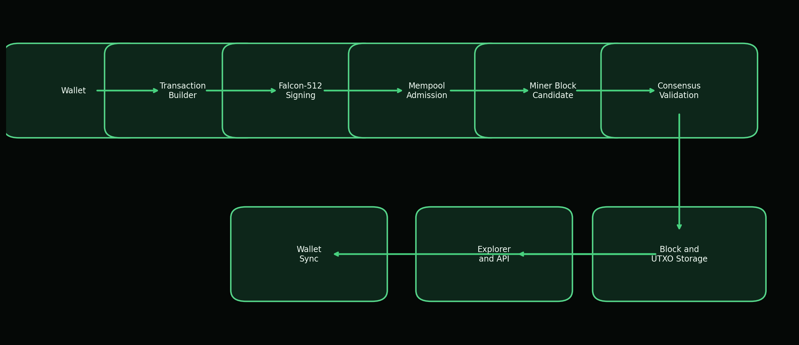

*Figure 1. Atho system overview from wallet transaction creation through storage, UTXO update, and downstream API or wallet synchronization.*

# 5. Protocol Architecture

Atho is a Layer 1 proof-of-work blockchain with a public UTXO ledger. Its architectural boundary is deliberately modular. `atho-core` defines the protocol objects and constants. `atho-storage` validates objects in context and persists accepted chainstate. `atho-node` composes storage, mempool, miner, RPC, P2P, and runtime status. `atho-wallet` owns key derivation and wallet datafiles. `atho-qt` remains a client. This division ensures that user interface code can be improved without creating a second interpretation of the ledger.

Full nodes have the broadest responsibility. They maintain the active chain, validate incoming blocks and transactions, track UTXOs, maintain mempool policy, expose local RPC status, and participate in peer synchronization. Miners are narrower: they assemble candidate blocks from node-provided state and perform proof-of-work search. Wallets are narrower still: they derive keys, produce addresses, scan for relevant activity, construct transactions, and sign exact bytes. Explorer and indexer software is useful for transparency and search, but it is a presentation layer over node-validated data.

The modular architecture also supports conservative upgrades. Protocol versions, rulesets, block versions, transaction versions, and storage schema versions are represented explicitly in the code. The current active ruleset is V1, while a V2 placeholder exists without an activation height. This makes future rule changes visible without pretending that upgrade execution has already been proven. Figure 2 shows the main runtime interfaces.

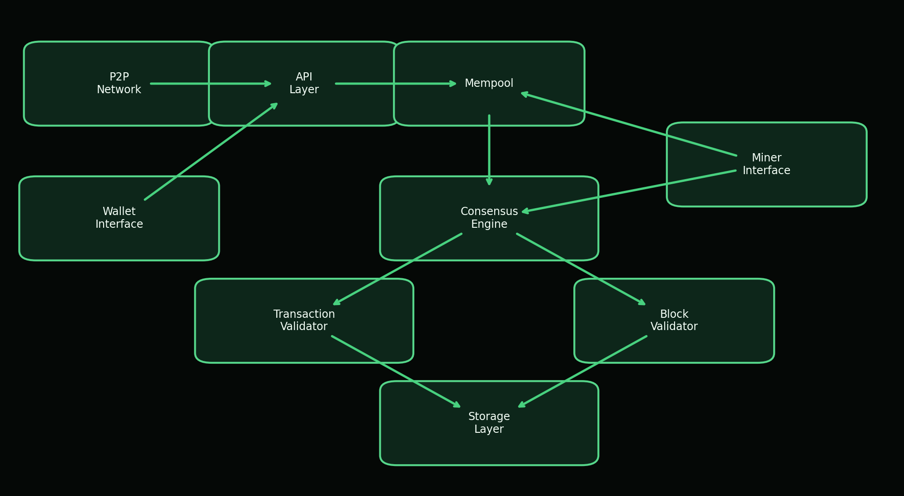

*Figure 2. Atho node architecture with explicit boundaries between P2P transport, API handling, mempool policy, consensus validation, storage, wallet-facing calls, and mining.*

# 6. Rust Implementation Strategy

Rust is appropriate for Atho because consensus software needs memory safety, predictable performance, explicit error handling, and concurrency discipline. The Rust project describes Rust as memory-efficient, without a runtime or garbage collector, and suitable for performance-critical services (Rust Project, n.d.). The Rust Book explains that ownership is checked by the compiler and does not slow down a program while it runs (Klabnik & Nichols, n.d.). These properties do not make software correct automatically, but they reduce several implementation hazards that are common in networked parsers, wallet code, and validation engines.

Atho's workspace reflects Rust's strengths. Consensus-critical protocol types live in `atho-core`. Storage and contextual validation live in `atho-storage`. Cryptographic boundary code lives in `atho-crypto`. Runtime orchestration lives in `atho-node`. The wallet and GUI have separate crates. This layout permits narrow dependency surfaces and makes it easier to test subsystem behavior directly. The repository also marks the core crate with `#![forbid(unsafe_code)]` and the crypto crate with `#![deny(unsafe_code)]`, which is a strong baseline for consensus-facing code.

Atho should continue to use Rust conservatively. Consensus paths should prefer domain types such as `Amount`, `BlockHeight`, `TxId`, `BlockHash`, and `Address` rather than raw integers and byte arrays where confusion is plausible. Recoverable failures should return `Result` and typed errors. Network message handling must not panic on malformed input. Serialization should be deterministic and tested with round-trip and negative fixtures. Fuzzing should target decoders and validators. Benchmarks should track Falcon verification, block validation, mempool admission, storage commit behavior, and sync propagation. Table 1 summarizes the mapping between Rust properties and Atho use cases.

**Table 1**
*Why Rust Fits Atho Core Infrastructure*

| Requirement | Rust Advantage | Atho Use Case |
| --- | --- | --- |
| Memory safety | Ownership and borrowing reduce broad classes of use-after-free and aliasing errors. | Consensus, P2P parsing, and wallet state handling. |
| Thread safety | Type-system constraints make many data-race patterns compile-time errors. | Parallel Falcon verification, mining workers, and status updates. |
| Performance | Compiled code with no tracing garbage collector supports predictable resource behavior. | Block validation, mempool admission, and proof-of-work loops. |
| Explicit errors | `Result<T, E>` represents recoverable failure without exceptions. | Validation rejection, storage failures, RPC errors, and address decoding. |
| Modularity | Cargo workspaces and crates make boundaries visible. | `atho-core`, `atho-storage`, `atho-wallet`, `atho-p2p`, `atho-rpc`, and `atho-qt`. |
| Auditability | Strong domain types and exhaustive matches make protocol state easier to inspect. | Network IDs, block versions, transaction versions, and signature domains. |

**Table 10**
*Rust Safety Requirements for Atho Consensus Code*

| Requirement | Reason | Enforcement Target |
| --- | --- | --- |
| Strong domain types for amounts, heights, IDs, hashes, and addresses. | Prevents accidental unit or context confusion. | `atho-core` and validation APIs. |
| Use `Result` for recoverable errors. | Consensus rejection is normal control flow, not a panic condition. | Storage, P2P, RPC, and wallet boundaries. |
| No silent `unwrap` in consensus paths. | Malformed network data must reject without crashing. | Validation, decode, and P2P handlers. |
| No panic in message handling. | Remote peers must not be able to stop the node. | P2P codec and sync integration. |
| Deterministic serialization. | All nodes must hash and sign the same bytes. | Transaction and block encoders. |
| Explicit consensus rule structs. | Upgrades must be auditable by height and version. | `consensus/rules.rs`. |
| Fuzz transaction and block decoders. | Parsers are adversarial inputs. | `fuzz/fuzz_targets`. |
| Benchmark signature and block validation. | Falcon cost must be visible. | `benches/` and release reports. |
| Minimize unsafe code. | Memory unsafety is unacceptable in consensus core. | `forbid(unsafe_code)` and review gates. |
| Pin dependencies and audit supply chain. | Consensus software inherits dependency risk. | `Cargo.lock`, `cargo audit`, release CI. |

# 7. Cryptographic Design

Atho's cryptographic design uses SHA3-256, SHA3-384, and Falcon-512 in distinct roles. NIST standardized the SHA3 family in FIPS 202, which specifies SHA3 hash functions based on KECCAK (NIST, 2015). Atho uses SHA3-256 for address and compact domain-separated digests, and SHA3-384 for block hashes, transaction IDs, signing prehashes, and 48-byte protocol identifiers. The code-level distinction matters because a blockchain protocol must define exactly which bytes are hashed and why.

Falcon-512 is the active signature scheme for transaction authorization. The Falcon submission describes a Fast-Fourier lattice-based compact signature scheme over NTRU, and the official specification lists Falcon-512 with 897-byte public keys and 666-byte signatures (Fouque et al., 2020). Atho's wrapper confirms those sizes in code and tests: public keys are 897 bytes, secret keys are 1,281 bytes, and signatures are 666 bytes. Those larger post-quantum signatures directly affect witness size, transaction size, and block capacity. Atho handles that through witness-separated sizing, maximum raw transaction bytes, maximum vbytes, and block weight rules.

Transaction signing is intentionally deterministic with respect to the message being signed. The wallet signs `SHA3-384(Transaction::base_bytes())` under the frozen `ATHO_TX_SIG_V1` domain. The witness contains the signature, public key, and per-input references. The node reconstructs the same base bytes, derives the same signing digest, verifies under the same domain, and rejects mismatches. This exact byte matching requirement is the core anti-malleability rule for Atho signatures. Figure 3 shows the flow.

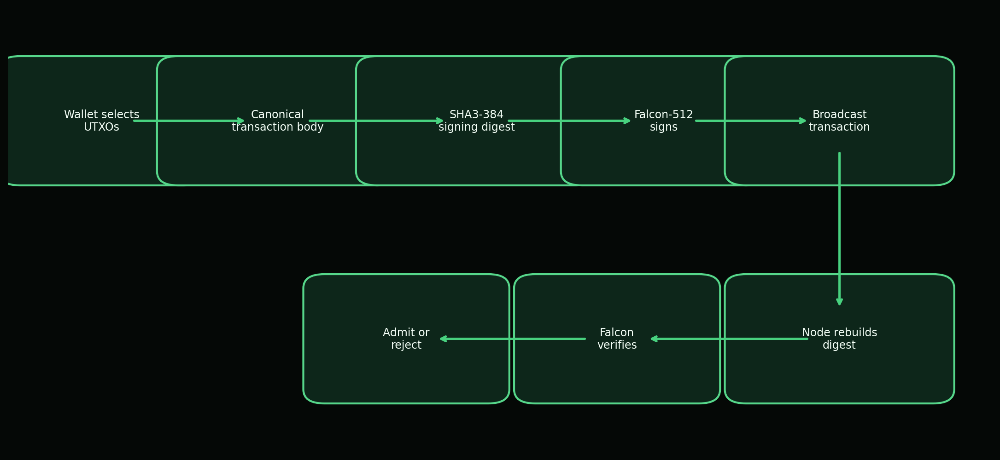

*Figure 3. Transaction signing and verification bind wallet-created transaction bytes to the `ATHO_TX_SIG_V1` domain and the SHA3-384 signing digest.*

# 8. Falcon-512 Implementation in Atho

Atho integrates Falcon-512 through `crates/atho-crypto/src/falcon.rs` and vendored `fn-dsa` crates under `Falcon 512 rs/`. The wrapper exposes typed public keys, secret keys, signatures, and keypairs. It also defines frozen size constants derived from the `fn-dsa` implementation: `FALCON_512_LOGN = 9`, `FALCON_512_PUBLIC_KEY_BYTES = 897`, `FALCON_512_SECRET_KEY_BYTES = 1_281`, and `FALCON_512_SIGNATURE_BYTES = 666`. These values are asserted by unit tests. The wrapper is not a CLI subprocess and not a remote signing service. It is an in-process Rust boundary around the vendored Falcon implementation.

Key generation supports two modes. Production generation obtains 48 bytes of OS randomness through `getrandom`, hashes or normalizes seed material as needed, invokes the Falcon keypair generator, and zeroizes seed buffers where practical. Deterministic generation from seed exists for tests and reproducible wallet derivation. The wallet derives a seed from mnemonic material, network tag, account, address kind, and index, hashes it with SHA3-384, and passes that seed into Falcon key generation. This model keeps wallet recovery deterministic while keeping normal signing randomized.

Signing and verification must match exactly. `sign` accepts an Atho signature domain, a secret key, and a message. It decodes the secret key, generates signing randomness, and calls the Falcon signer with `DomainContext(domain.label().as_bytes())` and `HASH_ID_SHA3_384`. `verify` checks public-key and signature lengths before decoding. If a public key cannot be decoded, verification returns `Ok(false)` rather than crashing. If a signature is malformed, the transaction validation path returns `InvalidWitness`. This fail-closed behavior is essential because signatures arrive through adversarial inputs.

Atho stores transaction witness data as a canonical `TxWitness` payload containing the full Falcon signature, the full public key, and input reference records. The witness has both canonical and compact byte encoders. The transaction ID is `SHA3-384(base_bytes())`, while the witness transaction ID and witness commitment include witness material. This allows the base transaction digest to remain stable for signing while the block can still commit to witness data. Full signatures are verified during mempool admission and block validation; block validation uses Rayon parallelism for independent non-coinbase transaction signatures.

Test vector requirements should be explicit. Atho already tests frozen sizes, deterministic key generation, sign/verify round trips, wrong messages, wrong public keys, and invalid lengths. Before any production launch claim, the project should add external Falcon/FN-DSA vectors when the FIPS 206 process publishes stable vectors, include wallet-generated transaction vectors, test malformed witness encodings, and verify that logging never exposes secret key or seed material. Table 2 lists the expected rejection behavior for common failure cases.

**Table 2**
*Falcon-512 Validation Failure Cases*

| Failure Case | Detection Method | Expected Result |
| --- | --- | --- |
| Malformed public key | Length check and decoding failure in `FalconPublicKey` verification path. | Return false or `InvalidWitness`; do not panic. |
| Malformed signature | Signature length check and verifier rejection. | Reject transaction before mempool or block acceptance. |
| Wrong signing message | Node reconstructs `SHA3-384(base_bytes())` and verifies against witness. | Reject as invalid witness. |
| Changed transaction output | Changed base bytes change the txid and signing digest. | Existing signature no longer verifies. |
| Changed input reference | Witness short reference and contextual UTXO lookup fail. | Reject for witness mismatch or missing input. |
| Replay attempt | Network-bound address digest, UTXO ownership, and spent-output checks fail when context differs. | Reject unless all exact UTXO and ownership conditions are valid. |
| Wrong network prefix | Address decoder maps visible prefix to network and validation checks UTXO network. | Reject cross-network use. |
| Oversized signature field | Signature field must equal 666 bytes. | Reject as invalid witness. |
| Missing signature | Witness payload must include signature and public key. | Reject as invalid witness. |
| Duplicate input with valid signature | Duplicate outpoint detection runs before acceptance. | Reject as duplicate input or mempool conflict. |

# 9. Transaction Model

Atho transactions use a public UTXO model. A transaction has a version, zero or more inputs, one or more outputs, a lock time, and witness bytes. Non-coinbase transactions must have at least one input and at least one output. Each input references a previous 48-byte transaction ID and an output index. Each output records a `value_atoms` integer and a locking script. One ATHO equals 100,000,000 atoms, so all accounting is integer accounting. This avoids floating-point monetary behavior in consensus code.

Atho distinguishes base bytes, full bytes, compact bytes, transaction ID, witness transaction ID, and witness commitment hash. The base bytes exclude witness data and are the source for the txid and signing digest. The full bytes include witness data. The vsize calculation follows a witness-weighted model: base data is weighted more heavily than witness data, and vbytes are derived from total weight. Current limits are 250,000 raw bytes and 250,000 vbytes per transaction. The minimum fee policy is 1 atom per vbyte, zero-value outputs are rejected, and relay and wallet policy reject spendable outputs below 50 atoms.

Mempool admission and block validation both enforce transaction structure. They reject unsupported versions, duplicate inputs, missing witnesses, wrong witness reference counts, missing signatures, missing public keys, invalid Falcon signatures, missing UTXOs, ownership mismatches, insufficient confirmations, and fee mismatches. A transaction becomes settled only after it is included in a valid block, the block is accepted into the best chain, and enough confirmations accumulate for the user's risk tolerance. Figure 4 describes that lifecycle.

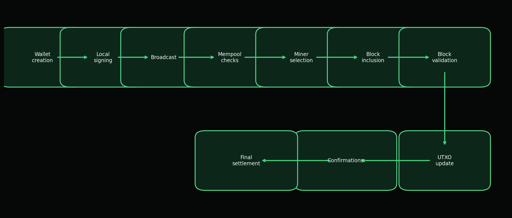

*Figure 4. Lifecycle of a spend from wallet construction through local signing, mempool checks, block inclusion, UTXO mutation, confirmations, and final settlement.*

# 10. UTXO and Accounting Rules

The UTXO set is the authoritative accounting structure for Atho. Each `UtxoEntry` stores network, txid, output index, value in atoms, locking script, creation height, and coinbase flag. Spending removes referenced entries and creates new entries for transaction outputs. The storage layer can apply a block and produce undo data, and it can disconnect a block by removing created outputs and reinserting spent outputs. That explicit apply/disconnect model is the basis for reorg safety.

Amount conservation is enforced by comparing the sum of input UTXO values with the sum of transaction output values. The difference is the actual fee. If outputs exceed inputs, validation fails. If the fee passed by the caller does not match the actual contextual fee, validation fails. In blocks, the sum of non-coinbase transaction fees must match the block fee accounting fields, and the coinbase output must equal the subsidy plus miner fees. A block that overpays the coinbase is rejected with a reward mismatch.

Maturity rules are also UTXO rules. Coinbase outputs require 150 confirmations. Standard non-coinbase spendability uses 7 confirmations as the wallet-facing confirmation policy. These constants are enforced by `UtxoEntry::required_confirmations` and `is_spendable_at`. Change outputs are ordinary transaction outputs generated by the wallet and become spendable under the same non-coinbase confirmation policy. Table 3 summarizes the accounting checks.

**Table 3**
*UTXO Validation Rules*

| Rule | Reason | Failure Result | Code Reference |
| --- | --- | --- | --- |
| Input outpoint must exist. | Spending nonexistent outputs would inflate value. | `MissingUtxo`. | `crates/atho-storage/src/validation.rs` |
| Input script must match the locked output. | Prevents spending an output with unrelated authorization material. | `InputOwnershipMismatch`. | `crates/atho-storage/src/validation.rs` |
| Public key digest must bind to a standard 32-byte locking script. | Binds witness public key to address digest for standard outputs. | `InputOwnershipMismatch`. | `locking_script_matches_public_key` |
| Coinbase outputs require 150 confirmations. | Prevents unstable mining rewards from being spent too early. | `InsufficientConfirmations`. | `crates/atho-storage/src/utxo.rs` |
| Standard non-coinbase spendability uses 7 confirmations. | Defines wallet-facing settlement convention. | `InsufficientConfirmations`. | `required_confirmations` |
| Input total must be greater than or equal to output total. | Enforces conservation of value and derives fee. | `FeeMismatch`. | `validate_transaction_with_context_common_and_schedule` |
| Each outpoint can be spent once per transaction and block. | Prevents double-spend within a local candidate. | `DuplicateInput` or `MempoolConflict`. | `block_inputs_are_unique` |
| Created UTXOs must match active network. | Prevents cross-network replay in chainstate. | `CrossNetworkReplay`. | `crates/atho-storage/src/utxo.rs` |

# 11. Block Structure

An Atho block contains a header, a transaction list, a witness map built from transaction witness payloads, and explicit fee accounting fields. The header includes version, network ID, height, previous block hash, merkle root, witness root, timestamp, difficulty target, and nonce. The canonical header encoding uses little-endian integer fields and 48-byte hash fields. The block hash is `SHA3-384(header.canonical_bytes())`.

The block body begins with the coinbase transaction. Coinbase transactions have no inputs and currently must produce exactly one output with the expected subsidy plus miner fees. Non-coinbase transactions follow. The merkle root commits to transaction IDs derived from base bytes. The witness root commits to witness-aware transaction commitments. Both roots are stored in the header and recomputed during validation. A mismatch rejects the block.

Current block limits are 3,000,000 vbytes, 12,000,000 raw serialized bytes, and 12,000,000 weight units. These values are defined in `crates/atho-core/src/constants.rs` and enforced in `crates/atho-storage/src/validation.rs`. Blocks also carry total fees, miner fees, burned fees, pooled fees, and cumulative burned amount. The current miner sets burned and pooled fees to zero and assigns selected fees to the miner, but the explicit fields leave room for future policy without hiding fee accounting. Figure 5 shows the validation pipeline.

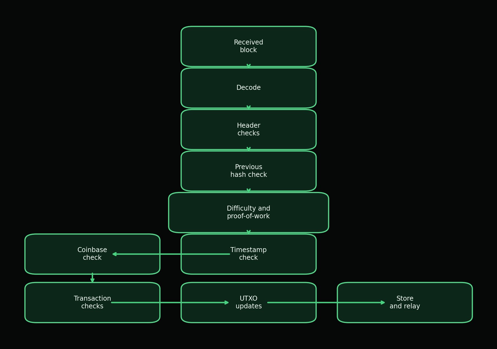

*Figure 5. Block validation pipeline used by the storage-backed consensus path before a block can become local durable truth.*

# 12. Proof-of-Work and Mining

Atho uses proof-of-work because it provides an open participation model in which block producers compete by expending verifiable computation. Proof-of-work has a long history as a mechanism for imposing computational cost on message production, including Hashcash (Back, 2002), and it was used by Nakamoto (2008) to produce a public transaction history whose modification requires redoing accumulated work. Atho adopts that broad security shape while defining its own SHA3-384 header hashing and target adjustment rules.

The proof-of-work profile is implemented in `crates/atho-core/src/consensus/pow.rs`. The target block time is 75 seconds. Retargeting occurs every block, using a 17-block averaging window, an 11-block median window, a damping factor of 4, a maximum upward adjustment of 16%, and a maximum downward adjustment of 32%. The target is represented as a 48-byte value. A block is valid only if its header hash is less than or equal to the target and the target is within defined bounds.

Mining is implemented in `crates/atho-node/src/miner.rs`. The miner reads the current tip, target, height, UTXO snapshot, and validated mempool entries. It selects transactions by fee rate while respecting block size and spent-set constraints, constructs a coinbase transaction, computes merkle and witness roots, and runs a parallel nonce search with Rayon worker threads. CPU mining exists through this path. GPU mining and a networked mining pool protocol are not currently documented as active components, so they are marked TBD. Table 4 describes component responsibilities.

**Table 4**
*Mining Components and Responsibilities*

| Component | Responsibility | Source |
| --- | --- | --- |
| Miner | Builds candidates and searches for nonce values. | `crates/atho-node/src/miner.rs` |
| Mempool | Provides validated entries ordered by fee rate, fee, then txid. | `crates/atho-node/src/mempool.rs` |
| Subsidy schedule | Calculates block subsidy from height. | `crates/atho-core/src/consensus/subsidy.rs` |
| Proof-of-work profile | Defines target, retarget, bounds, and chainwork comparison. | `crates/atho-core/src/consensus/pow.rs` |
| Validation path | Rechecks solved blocks before acceptance. | `crates/atho-storage/src/validation.rs` |
| Storage | Commits accepted blocks and UTXO state. | `crates/atho-storage/src/db.rs` |

# 13. Monetary Policy and Emissions

Atho's monetary policy is defined by source constants and subsidy functions. One ATHO is 100,000,000 atoms. The maximum supply constant is 168,000,000 ATHO. The initial subsidy is 50 ATHO per block. The halving interval is 1,680,000 blocks. The target block time is 75 seconds. The current subsidy function computes integer ATHO rewards using right-shift halving: 50, 25, 12, 6, 3, 1, and then 0 after subsequent halvings. The cumulative subsidy function is bounded by the maximum supply constant, and current tests assert that cumulative issuance does not exceed the supply ceiling.

The integer halving detail is important. A mathematical infinite geometric series beginning at 50 ATHO and halving every interval would sum to 168,000,000 ATHO over 1,680,000-block intervals. The current code halves integer ATHO values, which means fractional ATHO subsidies are not emitted after the reward reaches 1 ATHO and shifts to 0. Therefore the implemented schedule should be described as a deterministic subsidy schedule under a 168,000,000 ATHO ceiling, not as a promise that every atom of the ceiling is emitted by the current integer subsidy function.

Nodes verify monetary policy during block validation. They calculate the expected subsidy for the block height, calculate total transaction fees, and require the coinbase output to equal subsidy plus miner fees. They also require block fee fields to add consistently. If a block overpays the coinbase, underpays fee accounting, uses unsupported versions, or violates supply bounds, validation rejects it. Table 5 lists the current monetary constants, and Figure 6 visualizes the reward and cumulative issuance path from the present source code.

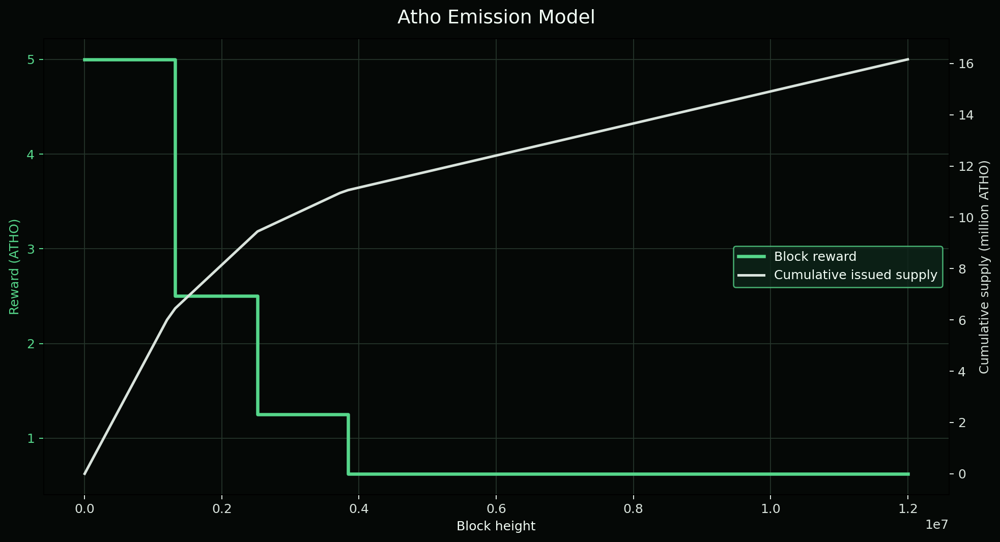

*Figure 6. Emission schedule derived from the current source constants: 50 ATHO initial subsidy, 1,680,000-block halving intervals, and a 168,000,000 ATHO maximum supply ceiling.*

**Table 5**
*Monetary Policy Constants*

| Constant | Value | Source File | Purpose |
| --- | --- | --- | --- |
| Atoms per ATHO | 100,000,000 | `crates/atho-core/src/constants.rs` | Defines the smallest accounting unit. |
| Maximum supply ceiling | 168,000,000 ATHO | `constants.rs`; `consensus/params.rs` | Upper bound for total issued supply. |
| Initial block reward | 50 ATHO | `constants.rs`; `consensus/subsidy.rs` | Genesis and early-chain subsidy. |
| Halving interval | 1,680,000 blocks | `constants.rs`; `consensus/subsidy.rs` | Height interval for right-shift reward reduction. |
| Target block time | 75 seconds | `constants.rs`; `consensus/pow.rs` | Expected spacing for difficulty adjustment. |
| Coinbase maturity | 150 blocks | `constants.rs`; `storage/utxo.rs` | Required confirmations before mined outputs are spendable. |
| Standard confirmations | 7 blocks | `constants.rs`; `storage/utxo.rs` | Wallet-facing settlement convention for non-coinbase outputs. |
| Minimum fee rate | 1 atom per vbyte | `constants.rs`; `storage/validation.rs` | Baseline anti-spam policy. |
| Dust threshold | 50 atoms | `crates/atho-core/src/constants.rs` | Relay and wallet policy floor for spendable outputs. |

# 14. Mempool Design

Atho's mempool is a validated, in-memory staging area. It is not consensus truth. It holds candidate transactions that passed local policy and contextual validation against the current UTXO view. The mempool tracks entries by txid and tracks spent inputs in a set so it can reject local conflicts before mining. It orders candidates by fee rate, then absolute fee, then txid. That ordering gives miners a deterministic local selection policy without changing consensus rules.

Admission runs through `validate_transaction_with_context`. The checks include supported version, non-empty outputs, raw size, vsize, zero-value outputs, duplicate inputs, minimum fee, witness shape, witness input references, UTXO existence, ownership, maturity, and Falcon signature. If any check fails, the transaction is rejected. After blocks are accepted or reorgs occur, the mempool revalidates entries against the new spend height and UTXO state, keeping entries that remain valid and dropping invalidated entries.

Several policies are intentionally marked as not yet active or TBD. No explicit mempool expiry rule, replacement-by-fee policy, or memory-size cap was found in the source files inspected for this paper. The current fee floor, 50-atom relay dust floor, and size limits provide baseline spam resistance, but production hardening should add explicit memory and expiry behavior so long-running public nodes can bound resource use under adversarial load. Figure 7 shows the current admission flow.

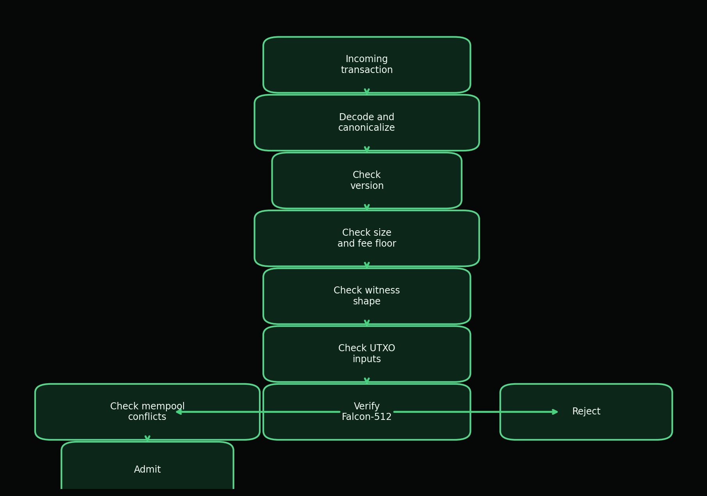

*Figure 7. Mempool admission validates structure, fees, UTXO availability, witness shape, Falcon signature, and local input conflicts before staging a transaction.*

# 15. Consensus Validation

Atho consensus validation has two major surfaces: transaction validation and block validation. Transaction validation first checks structure: non-coinbase inputs, supported version, outputs, size limits, non-zero output values, duplicate inputs, minimum fee, witness presence, witness reference count, and witness short references. It then verifies the Falcon signature. Contextual validation adds UTXO lookup, locking-script equality, standard address digest ownership, maturity, and fee calculation. This staged approach avoids expensive signature work when a transaction is structurally invalid.

Block validation checks non-empty body, supported block version, network ID, height, timestamp, raw size, vsize, weight, merkle root, witness root, target bounds, proof-of-work, subsidy, cumulative supply, coinbase correctness, duplicate transaction IDs, duplicate block inputs, and non-coinbase transaction structure. Contextual block validation then verifies expected parent hash, median-time behavior, expected target, proof-of-work against expected target, transaction fees, UTXO spend and creation, witness commitment references, and fee-accounting consistency.

Chain selection uses accumulated chainwork rather than height alone. Reorg handling disconnects old suffix blocks and applies a candidate branch, restoring prior state if candidate application fails. Orphan and branch buffers in the P2P layer are transient and rechecked against global state after accepted blocks. Peer penalty or disconnect behavior exists through the P2P ban and quality tracking scaffolding, while consensus rejection remains local. Network code can propose objects, but it cannot bypass validation. Table 6 lists invalid cases that must remain consensus critical.

**Table 6**
*Consensus-Critical Invalid Cases*

| Invalid Case | Validation Surface | Expected Outcome |
| --- | --- | --- |
| Bad previous hash | Contextual block validation compares expected parent hash. | `BlockParentHashMismatch`. |
| Invalid proof-of-work | Header hash must be less than or equal to target. | `ProofOfWorkInvalid`. |
| Invalid coinbase | First transaction must be coinbase with exact expected reward. | `InvalidCoinbase` or `CoinbaseRewardMismatch`. |
| Oversized block | Raw bytes, vbytes, and weight are bounded. | `BlockTooLarge`. |
| Duplicate transaction | Transaction IDs in a block must be unique. | `DuplicateTransactionId`. |
| Double-spend | Block and mempool spent-input sets reject repeated outpoints. | `MempoolConflict` or missing UTXO. |
| Invalid signature | Falcon verifier must accept exact digest/domain/key/signature. | `InvalidWitness`. |
| Invalid timestamp | Zero timestamps and median-time violations are rejected. | `InvalidBlockTimestamp`. |
| Bad Merkle root | Header merkle root must match transaction txids. | `BlockMerkleRootMismatch`. |
| Over-reward | Coinbase value must equal subsidy plus miner fees. | `CoinbaseRewardMismatch`. |
| Immature coinbase spend | UTXO spendability checks confirmation requirement. | `InsufficientConfirmations`. |
| Wrong network ID | Block header network must match local network. | `BlockNetworkMismatch`. |
| Malformed serialization | Decode and typed payload parsing fail before validation. | Reject malformed object or peer message. |

# 16. Network Layer

Atho's network layer is implemented primarily in `crates/atho-p2p`. Network parameters define mainnet, testnet, regnet, and prunetest with unique consensus IDs, wire magic values, default P2P ports, default RPC ports, visible address prefixes, and blank DNS seed lists. Current ports are 56000 for mainnet P2P and 9010 for mainnet RPC, 9100 and 9110 for testnet, 9200 and 9210 for regnet, and 9300 and 9310 for prunetest. Wire magic values are `a7 54 48 01`, `a7 54 48 02`, `a7 54 48 03`, and `a7 54 48 04` respectively.

The peer protocol includes `version`, `verack`, `ping`, `pong`, `getaddr`, `addr`, `inv`, `getdata`, `notfound`, `getheaders`, `headers`, `block`, `tx`, `mempool`, compact block, get-block-transaction, and block-transaction messages. The handshake validates matching network, supported protocol version, matching genesis hash, matching active ruleset version, and the version/verack sequence. Hard limits include an 8 MiB maximum message size, 1,000 addresses per message, 50,000 inventory entries, 2,000 headers, 128 blocks in flight, 256 requests per peer, 32 inbound peers, 8 outbound peers, and a ban threshold of 100.

Headers-first sync begins with a block locator, requests headers, validates linkage, and requests missing blocks by inventory. Compact block reconstruction exists in protocol code, but broader compact block burst hardening remains incomplete. DNS seeds are intentionally blank, so live bootstrap currently depends on manual peers. The network layer should remain a transport and synchronization layer only. Every block and transaction received from a peer must still pass local consensus validation. Figure 8 summarizes the sync and propagation flow.

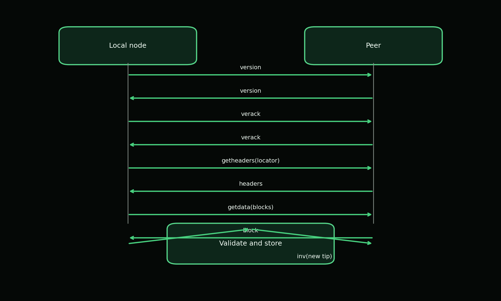

*Figure 8. Headers-first synchronization and block propagation ensure that network transport proposes data while local consensus remains the acceptance authority.*

# 17. Storage Layer

Atho's storage layer owns durable local truth. It uses a hybrid model implemented primarily through `crates/atho-storage/src/block_files.rs` and `crates/atho-storage/src/db.rs`. Full raw block bytes are stored in Bitcoin-style flat block files with the wrapper `[network magic][payload length][canonical raw block]`, and those files rotate at 128 MiB. LMDB remains the indexed state engine and stores one environment per network with named databases for block metadata, height mappings, transaction archives, UTXOs, peers, addresses, and peer health. Atho relies on LMDB's atomic commit behavior to prevent a local node from exposing a mixed-height state after a crash or partial write.

The canonical chainstate snapshot contains height, tip hash, and an optional tip header. LMDB block archive records store height, block hash, parent hash, network identity, file number, offset, payload length, raw block size, weight and vsize metadata, timestamp, chainwork, validation flags, pruning state, and other header fields needed for indexed queries. Transaction archive records store height, block hash, transaction index, txid, and transaction. UTXOs are serialized by outpoint. When a new best-chain block is accepted, Atho appends the raw block bytes to the current network's flat block file, records the file pointer, and commits block metadata, transaction archive records, chainstate snapshot, and full UTXO dataset through LMDB. Figure 11 shows the commit model.

Storage also participates in recovery. If persisted state is corrupt, incomplete, cross-network inconsistent, or schema mismatched, the storage layer can quarantine affected local files and rebuild from genesis. This fail-closed approach is safer than silent repair. The same per-network separation also applies to block archives: wrong-network flat block parsing fails when the wrapper magic or embedded block network identifier does not match the active network. Pruning removes old raw block archive data only after the configured retention depth, while LMDB keeps the indexed metadata and live chainstate needed for ongoing validation and restart. However, the current project documentation identifies schema migration breadth, repair tooling, pruning lifecycle coverage, and peer-served snapshot sync as incomplete areas. Production readiness depends on hardening those paths because long-lived payment infrastructure must survive more than the common full-history happy path.

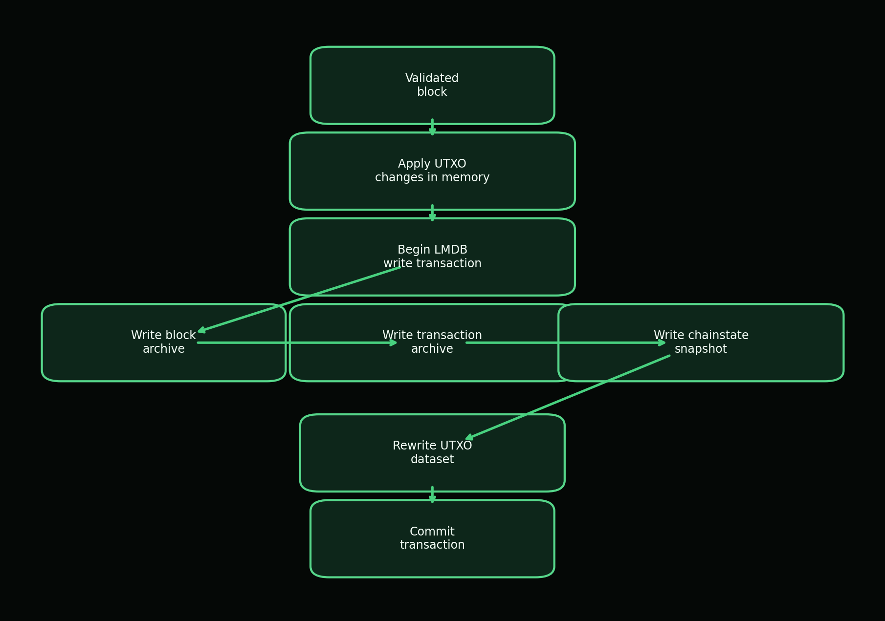

*Figure 11. Accepted blocks are archived in Bitcoin-style flat block files while block metadata, transaction indexes, chainstate snapshots, and UTXO state are committed through LMDB to avoid mixed-height persistence.*

# 18. Wallet Architecture

The wallet owns user secrets, deterministic address derivation, keypool behavior, wallet state capture, and wallet datafile encryption. It does not own consensus truth. A wallet can derive addresses and sign transactions, but balances and confirmations must come from node-validated chainstate. This separation is essential because wallet UX and chain validity have different trust boundaries.

Wallets can be created from mnemonic phrases or seeds. The wallet derives a 32-byte wallet seed, tracks independent receive and change counters, and pre-fills a keypool for fast address allocation. Address derivation uses the wallet seed, network domain tag, account, address kind, and index to generate deterministic Falcon keypairs. The public key is then converted into a payment digest and visible Base56 address. The default restore gap limit is 1,000, allowing recovery scans to inspect a window of possible receive and change addresses.

Wallet datafiles use a versioned binary envelope named `.datafile`. An empty password stores plaintext state explicitly. A non-empty password uses PBKDF2-HMAC-SHA256 with 600,000 iterations, a 16-byte salt, AES-256-GCM encryption, a 12-byte nonce, and authenticated additional data containing the wallet datafile scheme and version. Private keys, seeds, and passwords must never be logged or exposed through public APIs. Offline signing is a plausible future mode but is not currently documented as a complete feature. Figure 9 shows the wallet-to-node boundary.

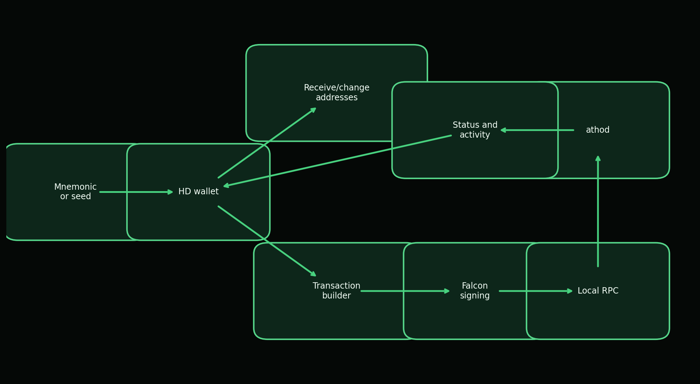

*Figure 9. The wallet owns keys and transaction construction, while the node owns validation, mempool admission, storage, status, and chain truth.*

# 19. Address and Encoding Design

Atho uses Base56 for human-facing addresses. Base56 is an encoding layer, not a hash function. The alphabet is `23456789ABCDEFGHJKMNPQRSTUVWXYZabcdefghjkmnpqrstuvwxyz`, which avoids several visually ambiguous characters. Address generation derives a SHA3-256 payment digest from a role label, network domain tag, and public key; encodes the digest as Base56; prepends the visible network prefix; computes a SHA3-256 checksum over prefix and body; and renders the first four checksum bytes as six Base56 characters.

Visible prefixes are `A` for mainnet, `T` for testnet, and `R` for regnet. Internal hashed-public-key strings use the `ATHO` prefix on mainnet and `ATHT` on testnet and regnet. The visible address and the internal HPK are intentionally different representations. Users see a short network-marked address with checksum protection. Backend logic can keep a stable key-oriented identity string for ownership and scanning.

Address decoding rejects invalid visible prefixes, insufficient length, invalid alphabet characters, checksum mismatches, and payloads that do not decode to the expected digest length. Network mismatch protection is therefore layered: the address itself carries a visible prefix, the UTXO stores a network, and block headers carry network identity. Table 7 summarizes the tradeoffs.

**Table 7**
*Address Design Tradeoffs*

| Design Choice | Benefit | Tradeoff |
| --- | --- | --- |
| Visible network prefix (`A`, `T`, `R`) | Human-readable network separation. | Requires careful UI validation for copied addresses. |
| Base56 alphabet | Avoids visually ambiguous characters such as `0`, `O`, `I`, and `l`. | Not directly compatible with common Base58 tooling. |
| SHA3-256 payment digest | Compact 32-byte address payload. | Address hides the full Falcon public key until witness reveal. |
| 6 Base56 checksum characters | Detects many transcription errors. | Checksum is not a security proof; it is an error-detection layer. |
| Internal HPK string | Stable backend key-oriented identifier. | Different from the visible address and must not be confused in UX. |

# 20. API and Developer Tooling

Atho's API layer is typed rather than stringly ad hoc. `crates/atho-rpc` defines `RpcRequest` and `RpcResponse` variants for block count, network, node status, block templates, block submission, transaction submission, UTXO listing, wallet activity, mempool information, and mempool spent inputs. Node status includes network, block count, tip hash, mempool count, mempool total fees, mempool fingerprint, running state, header sync state, best sync height, and network diagnostics.

The RPC server object is intentionally small, while mutable operations such as submitting blocks and transactions are handled by the node runtime. This prevents a generic API server from becoming a second owner of chainstate. Public RPC is not documented as open by default. Operator guidance keeps RPC private or loopback-local, while P2P handles public peer connectivity. Authentication, API keys, public rate limiting, SDK packages, and a stable external explorer API should be treated as future product work unless corresponding source files define them.

A future OpenAPI surface can be derived from the existing typed requests. The following example is illustrative rather than a source-of-truth API contract:

```text
GET /v1/node/status
  response:
    network: "atho-mainnet"
    block_count: 123456
    tip_hash: "<48-byte hex>"
    mempool_count: 12
    headers_synced: true

POST /v1/transactions
  body:
    transaction: "<canonical transaction object>"
    fee_atoms: 1234
  response:
    txid: "<48-byte hex>"
```

# 21. Explorer and Indexer

An explorer or indexer is useful for transparency but must never be treated as consensus authority. Its role is to make node-validated data searchable: block height, block hash, transaction ID, address activity, UTXO status, mempool state, network statistics, and fee or confirmation information. The current repository contains transaction archive records, block archive records, wallet activity responses, and local status endpoints that can support explorer-like functionality, but a full standalone explorer/indexer component was not found as a separate production crate.

Public UTXO chains have privacy limitations. Address reuse, visible transaction graph structure, input/output linkage, timing information, and public mempool propagation can reveal patterns. Atho is not documented as a default privacy chain, so an explorer should present chain transparency honestly without implying confidentiality. Wallets can reduce avoidable linkage by using fresh receive and change addresses, but protocol-level transaction privacy is outside the current documented scope.

# 22. Security Model

Atho's security model assumes adversarial inputs, untrusted peers, unreliable local storage, fallible operator environments, and future cryptographic migration pressure. The node must reject malformed transactions and blocks without crashing. The wallet must protect secrets at rest and avoid exposing private material through logs or public APIs. The network must enforce bounds before allocating untrusted data. The storage layer must avoid mixed-height persistence. Release tooling must avoid substituting unverified binaries. These are practical engineering requirements, not optional polish.

The quantum threat model is a future adversary with a cryptographically relevant quantum computer capable of attacking classical public-key signature schemes. NIST identifies post-quantum cryptography as a response to quantum threats against current public-key systems (NIST, 2024b). Atho's primary mitigation is to use Falcon-512 for transaction signatures. This reduces dependence on classical elliptic-curve signatures, but it does not eliminate all cryptographic risk. Falcon implementation correctness, side-channel resistance, random number quality, eventual FIPS 206 alignment, and domain separation all remain important.

The classical consensus threat model includes double spends, invalid coinbase rewards, duplicate inputs, bad merkle roots, wrong network objects, invalid timestamps, and reorgs. Atho mitigates these with UTXO lookup, amount conservation, maturity rules, proof-of-work, chainwork comparison, version checks, root recomputation, target bounds, and atomic storage commits. The mempool mitigates local double spends with a spent-input set, but mempool acceptance is not final settlement. Confirmations and chainwork remain the settlement signal.

Network threats include Sybil attacks, eclipse attacks, unsolicited wrong-network traffic, malformed payloads, oversized messages, inventory floods, and abusive peers. Atho's current mitigations include unique network magic, version handshake checks, genesis and ruleset validation, message-size limits, inventory limits, address limits, headers limits, peer caps, subnet caps, ban scores, and transient orphan buffers. Public network hardening remains a documented gap because the existence of a live TCP runtime is not the same as long-run hostile mesh maturity.

Software supply-chain risk is also part of the model. Rust's type system reduces many memory and concurrency hazards, but dependencies, vendored cryptographic code, build scripts, packaging artifacts, and release signing still require review. The repository uses checksum-oriented packaging and installer payload verification, but broader signing, notarization, dependency auditing, and reproducible-build checks are identified as future hardening. Table 8 summarizes the major threats, mitigations, and residual risks.

**Table 8**
*Atho Threat Model*

| Threat | Attack Path | Mitigation | Residual Risk |
| --- | --- | --- | --- |
| Quantum attack on classical signatures | Future quantum adversary targets discrete-log signatures. | Atho uses Falcon-512 for active transaction signatures. | Falcon standardization and implementation assurance remain important. |
| Signature forgery | Forge witness for someone else's UTXO. | Domain-separated Falcon verification against canonical digest. | Side-channel and dependency risks require audits. |
| Double spend | Spend same outpoint in mempool or block. | UTXO lookup, duplicate input checks, and spent-input tracking. | Reorgs can alter confirmation depth. |
| Mempool spam | Flood node with low-value or oversized transactions. | Size limits, fee floor, witness checks, and conflict tracking. | Dedicated memory caps are still a future hardening item. |
| Sybil or eclipse attack | Surround node with controlled peers. | Network identity, handshake checks, peer limits, scoring, manual peers. | Long-run public peer soak remains incomplete. |
| Malformed serialization | Crash parser or create ambiguous object. | Typed decoding, bounds, fuzz targets, fail-closed errors. | Coverage should expand with protocol surface. |
| Supply inflation | Overpay coinbase or miscalculate fees. | Subsidy function, fee sum checks, coinbase validation. | Future rule changes must preserve tests. |
| Database corruption | Crash or disk fault exposes mixed state. | LMDB atomic transaction and quarantine behavior. | Repair and migration tooling need expansion. |
| Wallet compromise | Password, mnemonic, or host compromise. | Encrypted datafiles, PBKDF2, AES-256-GCM, zeroization where practical. | Endpoint compromise can still steal secrets. |
| Build/release substitution | Malicious package replaces binaries. | Checksums and packaging manifests. | Signing and notarization hardening remains incomplete. |
| Unsafe Rust or FFI bug | Memory-unsafe boundary causes consensus fault. | `forbid(unsafe_code)` or `deny(unsafe_code)` in core crypto crates. | Vendored cryptographic code needs ongoing review. |
| API abuse | Remote caller manipulates node operations. | RPC defaults to loopback and typed request dispatch. | Authentication and public API policy need explicit production gates. |

# 23. Performance and Scalability

Atho's performance target is safe throughput, not validation bypass. The current documented practical estimate is about 65 to 80 transactions per second for small 1-input, 1-output transactions, assuming roughly 500 vbytes per transaction, 3,000,000-vbyte blocks, and 75-second block intervals. This is a transaction-mix estimate, not a universal promise. Falcon witnesses, larger scripts, more inputs, more outputs, and network propagation conditions all affect realized throughput.

The main performance cost introduced by post-quantum signatures is larger witness data and signature verification work. Atho addresses this with witness-separated sizing, size limits, staged validation, mempool prevalidation, and parallel verification for independent transactions in a block. Block validation first rejects cheap structural failures, then performs contextual UTXO checks, then parallelizes Falcon verification where safe. The code uses Rayon for block signature verification and for mining nonce search.

Scalability must not weaken validation. Caches, batching, compact relay, low-copy parsing, and indexing are useful only when they preserve exact message, network, ruleset, key, and chainstate context. Atho's docs describe a strategy of validating once on mempool admission, reusing exact safe results only when bytes and context match, batching UTXO work, and invalidating caches on reorgs, restarts, and context changes. Figure 10 summarizes the intended validation work distribution.

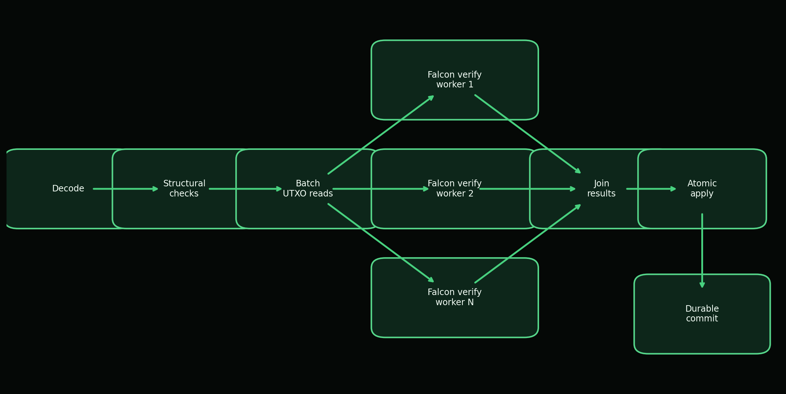

*Figure 10. Atho keeps structural and state checks deterministic while parallelizing independent Falcon verification work where transaction independence permits it.*

# 24. Testing, Auditing, and Benchmarking

Atho's hardening strategy is layered. The repository includes unit tests for protocol and wallet primitives, integration tests for node, storage, RPC, P2P, and Qt behavior, lifecycle tests for mining and send/receive flows, adversarial mutation campaigns, fuzz targets, and benchmark harnesses. The documented full-stack pass reports tests across `atho-core`, `atho-wallet`, `atho-p2p`, `atho-storage`, `atho-node`, and `atho-qt`, plus adversarial campaign results with zero unexpected accepts, unexpected rejects, panics, mismatches, silent accepts, or silent state divergence in the reported run.

Testing must continue to expand before production claims. Required areas include consensus test vectors, signature test vectors, serialization test vectors, block validation fixtures, mempool adversarial tests, reorg simulations, fork handling tests, long-running node tests, network simulation, propagation benchmarks, storage migration tests, pruning and snapshot lifecycle tests, OS-level GUI automation, and security review of cryptographic dependencies. Fuzzing should focus on parsers, transaction/witness decoding, block decoding, P2P framing, RPC request decoding, compact block reconstruction, and validation entry points.

Benchmarking should be release-gated for hot paths: Falcon key generation, signing, verification, transaction validation, block validation, mempool admission, UTXO commit, proof-of-work nonce search, P2P framing, compact block reconstruction, and wallet datafile load/save. Benchmarks should report hardware, compiler version, feature flags, dataset shape, and whether results are debug or release builds. Table 9 gives the required test coverage matrix.

**Table 9**
*Required Test Coverage Matrix*

| Area | Current Coverage | Required Before Production Claim |
| --- | --- | --- |
| Consensus constants | Frozen unit tests in `atho-core`. | Cross-version fixtures and release-gated regression tests. |
| Transaction validation | Unit, integration, and fuzz targets. | Larger adversarial corpus with wallet-generated vectors. |
| Falcon signatures | Length, round-trip, wrong-message, and wrong-key tests. | Independent test vectors and side-channel review. |
| Block validation | Merkle, witness root, proof-of-work, fees, and context tests. | Longer chain and reorg fixture suite. |
| Mempool | Admission, conflicts, sorting, revalidation. | Memory-limit, expiry, and replacement-policy tests when policies exist. |
| P2P | Handshake, codec, sync, relay, live socket tests. | 50-node or larger churn and long-run soak coverage. |
| Storage | Atomic commit, restart, corruption, quarantine. | Schema migration, repair, pruning, and snapshot import/export coverage. |
| Wallet | Mnemonic restore, keypool, datafile, address derivation. | Hardware/OS interaction and hostile datafile tests. |
| Qt client | Backend-synced lifecycle tests. | OS-level GUI automation in CI. |
| Release | Packaging and checksums. | Signing, notarization, reproducible-build verification. |

# 25. Governance and Upgrade Philosophy

Atho's upgrade philosophy should remain conservative. Consensus changes should be rare, documented, reviewed, versioned, tested at activation boundaries, and released with clear operator instructions. The repository already defines protocol version, storage schema version, ruleset versions, block versions, transaction versions, and scheduled activation records. The active V1 ruleset begins at genesis. The V2 placeholder is explicit but inactive, which is the correct posture until a real rule change is specified and tested.

Hard forks and soft forks should be treated as explicit network events, not incidental code deployments. A hard fork loosens or changes rules in a way that old nodes cannot validate; a soft fork restricts behavior within old rules. Atho should document the activation height, affected rules, migration requirements, rollback plan, test vectors, and release signatures for any consensus upgrade. Community review and independent audits are not replacements for tests, but they are important safeguards for a public settlement network.

# 26. Roadmap

The repository's roadmap is ordered around operational risk reduction. The first priority is hardening the live peer runtime with longer multi-peer soak coverage, latency and packet-loss harnesses, ban/subnet integration tests, and propagation benchmarks. The second priority is pruning and snapshot hardening, including deeper pruning execution, peer-served snapshot sync, and pruning/reorg interaction tests. The third priority is schema migration and repair tooling, including versioned migrations, reindex or repair commands, and explicit operator guidance.

Additional phases include live multi-node integration soaks, OS-level Qt automation, activation of a real V2 test ruleset, delivery and release hardening, explorer and wallet integration improvements, mining tool maturity, documentation completion, external security review, testnet launch hardening, and mainnet candidate preparation. No dates should be promised unless the repository adds dated release commitments. The correct milestone is evidence: reproducible tests, stable artifacts, hardened network behavior, audited cryptography boundaries, and clear operator documentation.

# 27. Conclusion

Atho's mission is to build a compact, auditable, post-quantum payment settlement network. Its strongest technical choices are the narrow UTXO model, node-owned truth, explicit consensus constants, Falcon-512 transaction signatures, SHA3-family hashing, Rust implementation, proof-of-work block production, durable LMDB-backed chainstate, and thin desktop client boundary. These choices support the project's slogan only if they remain visible, tested, and conservative.

Public settlement matters because users and operators should be able to verify the ledger without trusting a hosted service. Post-quantum design matters because long-lived public ledgers cannot assume classical signature systems remain adequate forever. Rust matters because payment infrastructure benefits from memory safety, explicit errors, and predictable performance. Proof-of-work and transparent rules fit Atho because the project is optimizing for open validation and simple issuance rather than broad runtime complexity.

What comes next is engineering completion: network soak, pruning and snapshot maturity, migration tooling, GUI automation, release signing, external cryptographic review, and a real activation test. The codebase is beyond prototype stage, but the white paper should be read as a technical statement of architecture and direction, not as a declaration that every production hardening item is finished.

# References

- American Psychological Association. (2020). *Publication manual of the American Psychological Association* (7th ed.). American Psychological Association.
- Atho Project. (2026a). *About Atho* [Internal project documentation]. `docs/overview/about-atho.md`.
- Atho Project. (2026b). *Atho source code workspace* [Internal software repository]. `crates/`.
- Atho Project. (2026c). *Current production status* [Internal project documentation]. `docs/production-readiness/current-status.md`.
- Atho Project. (2026d). *Testing and hardening* [Internal project documentation]. `docs/testing-audits/testing-and-hardening.md`.
- Atho Project. (2026e). *Roadmap to production* [Internal project documentation]. `docs/production-readiness/roadmap.md`.
- Back, A. (2002). *Hashcash: A denial of service counter-measure*. https://www.hashcash.org/papers/
- Fouque, P.-A., Hoffstein, J., Kirchner, P., Lyubashevsky, V., Pornin, T., Prest, T., Ricosset, T., Seiler, G., Whyte, W., & Zhang, Z. (2020). *Falcon: Fast-Fourier lattice-based compact signatures over NTRU*. https://falcon-sign.info/falcon.pdf
- Klabnik, S., & Nichols, C. (n.d.). *The Rust programming language*. Rust Project. https://doc.rust-lang.org/book/
- Nakamoto, S. (2008). *Bitcoin: A peer-to-peer electronic cash system*. https://bitcoin.org/bitcoin.pdf
- National Institute of Standards and Technology. (2015). *SHA-3 standard: Permutation-based hash and extendable-output functions* (FIPS PUB 202). https://doi.org/10.6028/NIST.FIPS.202
- National Institute of Standards and Technology. (2022). *Status report on the third round of the NIST Post-Quantum Cryptography Standardization Process* (NIST IR 8413-upd1). https://csrc.nist.gov/pubs/ir/8413/upd1/final
- National Institute of Standards and Technology. (2024a, August 13). *Announcing approval of three Federal Information Processing Standards (FIPS) for post-quantum cryptography*. https://csrc.nist.gov/News/2024/postquantum-cryptography-fips-approved
- National Institute of Standards and Technology. (2024b). *Post-quantum cryptography: PQC standardization process*. https://csrc.nist.gov/Projects/post-quantum-cryptography/pqc-standardization
- National Institute of Standards and Technology. (2025, September 25). *FIPS 206: FN-DSA (Falcon)* [Presentation]. https://csrc.nist.gov/Presentations/2025/fips-206-fn-dsa-falcon
- Rust Project. (n.d.). *Rust programming language*. https://www.rust-lang.org/
- Shor, P. W. (1997). Polynomial-time algorithms for prime factorization and discrete logarithms on a quantum computer. *SIAM Journal on Computing, 26*(5), 1484-1509. https://doi.org/10.1137/S0097539795293172

# Appendix A: Glossary

UTXO: Unspent transaction output, the basic unit of spendable chain value. Chainstate: The local authoritative view of the accepted tip, UTXOs, and related metadata. Mempool: The local staging area for valid but unconfirmed transactions. Witness: Signature and reference material carried separately from transaction base bytes. Ruleset: The active consensus rule selection for a height range. Reorg: A branch switch after a higher-work branch becomes preferred. Keypool: Pre-derived wallet address paths reserved for fast allocation. Recovery window: The address discovery window used when reconstructing wallet state from seed or mnemonic material. HPK: Atho's internal hashed-public-key string. Vbyte: Virtual byte used for witness-weighted sizing. Atom: Smallest Atho monetary unit; 100,000,000 atoms equal 1 ATHO.

# Appendix B: Protocol Constants

The following source-derived constants are used throughout the paper: `ATOMS_PER_ATHO = 100_000_000`; `MAX_SUPPLY_ATHO = 168_000_000`; `INITIAL_BLOCK_REWARD_ATHO = 50`; `HALVING_INTERVAL_BLOCKS = 1_680_000`; `COINBASE_MATURITY_BLOCKS = 150`; `STANDARD_TX_CONFIRMATIONS = 7`; `MIN_TX_FEE_PER_VBYTE_ATOMS = 1`; `BLOCK_TIME_SECONDS = 75`; `MAX_BLOCK_VBYTES = 3_000_000`; `MAX_BLOCK_RAW_BYTES = 12_000_000`; `MAX_TRANSACTION_RAW_BYTES = 250_000`; `MAX_TRANSACTION_VBYTES = 250_000`; `ADDRESS_DIGEST_BYTES = 32`; `ADDRESS_CHECKSUM_BYTES = 4`; `ADDRESS_CHECKSUM_BASE56_CHARS = 6`; `WITNESS_SIGNATURE_REFERENCE_BYTES = 16`; `PROTOCOL_VERSION = 1`; `STORAGE_SCHEMA_VERSION = 3`; and `ATHO_SIGNATURE_RULES_VERSION = 1`.

Current networks are mainnet, testnet, and regnet. Their internal IDs are `atho-mainnet`, `atho-testnet`, and `atho-regnet`; consensus IDs are 1, 2, and 3; visible prefixes are `A`, `T`, and `R`; P2P ports are 56000, 9100, and 9200; RPC ports are 9010, 9110, and 9210; and wire magic values are `a7 54 48 01`, `a7 54 48 02`, and `a7 54 48 03`.

# Appendix C: Code Reference Map

The code reference map summarizes major components without reproducing source code.

**Table 11**
*Code Reference Map*

| Component | Module/File Path | Key Structs or Functions | Consensus-Critical | Notes |
| --- | --- | --- | --- | --- |
| Constants | `crates/atho-core/src/constants.rs` | Monetary, size, address, fee, timing constants | Yes | Primary source for fixed protocol values. |
| Consensus params | `crates/atho-core/src/consensus/params.rs` | `ConsensusParams`, `CONSENSUS_PARAMS` | Yes | Frozen parameter aggregate and tests. |
| Subsidy | `crates/atho-core/src/consensus/subsidy.rs` | `block_subsidy_atoms`, `cumulative_subsidy_atoms` | Yes | Defines issuance schedule. |
| Proof-of-work | `crates/atho-core/src/consensus/pow.rs` | `POW_PROFILE`, `target_for_next_block`, `meets_target` | Yes | Target bounds, retarget, chainwork. |
| Rules/versioning | `crates/atho-core/src/consensus/rules.rs` | `ConsensusRules`, `ScheduledActivation`, `rules_at_height` | Yes | Active V1 and inactive V2 placeholder. |
| Transaction | `crates/atho-core/src/transaction.rs` | `Transaction`, `TxInput`, `TxOutput`, `TxWitness` | Yes | Serialization, txid, signing digest, witness. |
| Block | `crates/atho-core/src/block.rs` | `BlockHeader`, `Block`, `merkle_root`, `witness_root` | Yes | Header commitments and block sizing. |
| Address encoding | `crates/atho-core/src/address.rs` | `encode_base56_address`, `decode_base56_address`, `public_key_digest` | Consensus adjacent | Payment digest and network prefixes. |
| Network identity | `crates/atho-core/src/network.rs` | `Network`, ports, prefixes, consensus IDs | Yes | Prevents cross-network confusion. |
| Falcon wrapper | `crates/atho-crypto/src/falcon.rs` | `generate`, `generate_from_seed`, `sign`, `verify` | Yes | Signature boundary and size checks. |
| Secret handling | `crates/atho-crypto/src/secret.rs` | `SecretBytes` | Security critical | Zeroization boundary. |
| Transaction/block validation | `crates/atho-storage/src/validation.rs` | `validate_transaction_with_context`, `validate_block_with_context` | Yes | Canonical validation path. |
| UTXO | `crates/atho-storage/src/utxo.rs` | `UtxoEntry`, `UtxoSet`, `apply_block`, `disconnect_block` | Yes | Accounting and rollback. |
| Database | `crates/atho-storage/src/db.rs` | `Database`, `commit_chainstate`, archive records | Consensus adjacent | Atomic LMDB persistence. |
| Mempool | `crates/atho-node/src/mempool.rs` | `Mempool`, `MempoolEntry`, `admit`, `revalidate` | Policy critical | Validated staging, conflict tracking. |
| Miner | `crates/atho-node/src/miner.rs` | `Miner`, `build_candidate_block`, `solve_block` | Consensus adjacent | Candidate assembly and nonce search. |
| Node runtime | `crates/atho-node/src/node.rs`; `runtime.rs`; `service.rs` | `Node`, `NodeRuntime`, `NodeService` | Operationally critical | Composes live backend behavior. |
| P2P protocol | `crates/atho-p2p/src/protocol.rs` | `NetworkMessage`, `MessagePayload`, `validate_version_message` | Consensus adjacent | Typed messages and bounds. |
| P2P config | `crates/atho-p2p/src/config.rs` | `NetworkParams`, `P2pLimits` | Security critical | Message and peer limits. |
| Handshake | `crates/atho-p2p/src/handshake.rs` | `HandshakeState`, `HandshakeAction` | Security critical | Network/ruleset/genesis checks. |
| RPC | `crates/atho-rpc/src/request.rs`; `response.rs` | `RpcRequest`, `RpcResponse`, `NodeStatus` | Boundary critical | Typed local API. |
| Wallet | `crates/atho-wallet/src/wallet.rs`; `hd.rs`; `keypool.rs` | `Wallet`, `HdWallet`, `Keypool` | Security critical | Key derivation and address allocation. |
| Wallet datafile | `crates/atho-wallet/src/wallet/datafile.rs` | `WalletDataFile`, `WalletEncryptionMode` | Security critical | AES-256-GCM, PBKDF2, versioned envelope. |
| Qt client | `crates/atho-qt/src/app/` | Pages, dialogs, startup, connection | No | Thin UI over backend truth. |
| Explorer/indexer | TBD | TBD | No | No standalone production explorer crate found. |

# Appendix D: Transaction Validation Pseudocode

```text
function validate_transaction(tx, declared_fee, spend_height, utxo_set, rules):
    if tx.is_coinbase():
        return Reject("coinbase not valid here")
    if tx.version != rules.transaction_version:
        return Reject("invalid transaction version")
    if tx.outputs.is_empty():
        return Reject("no outputs")
    if tx.full_size_bytes > MAX_TRANSACTION_RAW_BYTES:
        return Reject("transaction too large")
    if tx.vsize_bytes > MAX_TRANSACTION_VBYTES:
        return Reject("transaction too large")
    if any(output.value_atoms == 0 for output in tx.outputs):
        return Reject("zero-value output")
    if has_duplicate_inputs(tx.inputs):
        return Reject("duplicate input")
    if declared_fee < tx.vsize_bytes * MIN_TX_FEE_PER_VBYTE_ATOMS:
        return Reject("fee below minimum")
    witness = parse_witness(tx.witness)
    if witness is missing or witness.input_refs.len != tx.inputs.len:
        return Reject("invalid witness")
    if !verify_falcon_signature(ATHO_TX_SIG_V1, witness.pubkey, tx.signing_digest(), witness.signature):
        return Reject("bad signature")
    input_total = 0
    for input in tx.inputs:
        utxo = utxo_set.lookup(input.previous_txid, input.output_index)
        if utxo is missing:
            return Reject("missing input")
        if utxo.locking_script != input.unlocking_script:
            return Reject("ownership mismatch")
        if !utxo.is_spendable_at(spend_height):
            return Reject("insufficient confirmations")
        input_total += utxo.value_atoms
    output_total = sum(output.value_atoms for output in tx.outputs)
    if input_total < output_total:
        return Reject("amount violation")
    actual_fee = input_total - output_total
    if actual_fee != declared_fee:
        return Reject("fee mismatch")
    return Accept(actual_fee)
```

# Appendix E: Block Validation Pseudocode

```text
function validate_block(block, expected_height, expected_network, expected_parent, expected_target, previous_blocks, utxo_set):
    if block.transactions.is_empty():
        return Reject("empty block")
    if block.header.network_id != expected_network:
        return Reject("wrong network")
    if block.header.height != expected_height:
        return Reject("wrong height")
    if block.full_size_bytes > MAX_BLOCK_RAW_BYTES or block.vsize_bytes > MAX_BLOCK_VBYTES:
        return Reject("block too large")
    if merkle_root(block.transactions) != block.header.merkle_root:
        return Reject("bad merkle root")
    if witness_root(block.transactions) != block.header.witness_root:
        return Reject("bad witness root")
    if block.header.previous_block_hash != expected_parent:
        return Reject("bad parent")
    if block.header.difficulty_target_or_bits != expected_target:
        return Reject("bad target")
    if !meets_target(block.header.block_hash(), expected_target):
        return Reject("bad proof of work")
    if block.header.timestamp < minimum_next_block_timestamp(previous_blocks):
        return Reject("bad timestamp")
    subsidy = block_subsidy_atoms(expected_height)
    validate_coinbase(block.transactions[0], subsidy + block.fees_miner_atoms)
    if has_duplicate_txids(block.transactions):
        return Reject("duplicate transaction")
    if has_duplicate_block_inputs(block.transactions[1:]):
        return Reject("double spend")
    fee_sum = 0
    for tx in block.transactions[1:]:
        fee = validate_transaction(tx, minimum_fee(tx), expected_height, utxo_set, active_rules)
        spend_inputs_and_create_outputs(tx, utxo_set)
        fee_sum += fee
    if fee_sum != block.fees_total_atoms:
        return Reject("fee mismatch")
    return Accept(updated_utxo_set)
```

# Appendix F: Mempool Admission Pseudocode

```text
function admit_to_mempool(entry, spend_height, utxo_set, mempool):
    txid = entry.transaction.txid()
    if mempool.contains(txid):
        return Reject("duplicate mempool entry")
    validate_transaction(entry.transaction, entry.fee_atoms, spend_height, utxo_set, active_rules)
    for input in entry.transaction.inputs:
        key = (input.previous_txid, input.output_index)
        if key in mempool.spent_inputs:
            return Reject("mempool conflict")
    for input in entry.transaction.inputs:
        mempool.spent_inputs.insert((input.previous_txid, input.output_index))
    mempool.entries[txid] = entry
    return Accept(txid)

function validate_coinbase_reward(block, height):
    subsidy = block_subsidy_atoms(height)
    expected = subsidy + block.fees_miner_atoms
    coinbase = block.transactions[0]
    if !coinbase.is_coinbase():
        return Reject("invalid coinbase")
    if coinbase.outputs.len != 1:
        return Reject("invalid coinbase")
    if coinbase.output_value_atoms() != expected:
        return Reject("coinbase reward mismatch")
    return Accept

function rollback_reorg(old_suffix, new_suffix, chainstate):
    undo_stack = []
    for block in reverse(old_suffix):
        undo = chainstate.disconnect_block(block)
        undo_stack.push(undo)
    for block in new_suffix:
        result = validate_and_apply(block, chainstate)
        if result is Reject:
            restore_old_chain(undo_stack, chainstate)
            return Reject("candidate branch failed")
    return Accept

function wallet_signing(wallet, tx, path):
    keypair = wallet.keypair_for_path(path)
    digest = SHA3_384(tx.base_bytes())
    signature = falcon_sign(ATHO_TX_SIG_V1, keypair.secret_key, digest)
    witness = build_witness(signature, keypair.public_key, tx.inputs)
    return tx.with_witness(witness)

function difficulty_check(header, expected_target):
    if header.difficulty_target_or_bits != expected_target:
        return Reject("target mismatch")
    if SHA3_384(header.canonical_bytes()) > expected_target:
        return Reject("proof of work invalid")
    return Accept
```

# Appendix G: Flowchart Source Text

Mermaid source files for all figures are written to `docs/whitepaper/diagrams/`. The PDF uses rendered PNG assets in `docs/whitepaper/assets/` because a local Mermaid renderer was not available in the execution environment.

## Figure 1. Atho System Overview

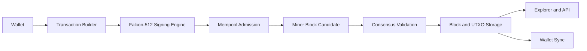

## Figure 2. Atho Node Architecture

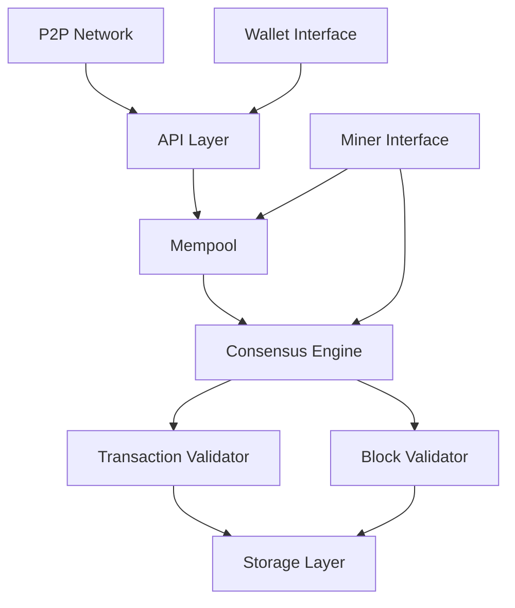

## Figure 3. Atho Transaction Signing and Verification Flow

```mermaid
flowchart LR
    UTXO[Wallet selects UTXOs] --> Body[Canonical transaction body]
    Body --> Digest[SHA3-384 signing digest]
    Digest --> Sign[Falcon-512 signs]
    Sign --> Broadcast[Broadcast transaction]
    Broadcast --> Rebuild[Node rebuilds digest]
    Rebuild --> Verify[Falcon verifies]
    Verify --> Admit[Admit or reject]
```

## Figure 4. Transaction Lifecycle

```mermaid
flowchart LR
    Wallet[Wallet creation] --> Signing[Local signing]
    Signing --> Broadcast[Broadcast]
    Broadcast --> Checks[Mempool checks]
    Checks --> Selection[Miner selection]
    Selection --> Inclusion[Block inclusion]
    Inclusion --> Validation[Block validation]
    Validation --> Update[UTXO spend/update]
    Update --> Confirm[Confirmations]
    Confirm --> Settlement[Final settlement]
```

## Figure 5. Block Validation Pipeline

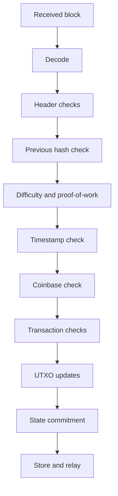

## Figure 6. Atho Emission Model

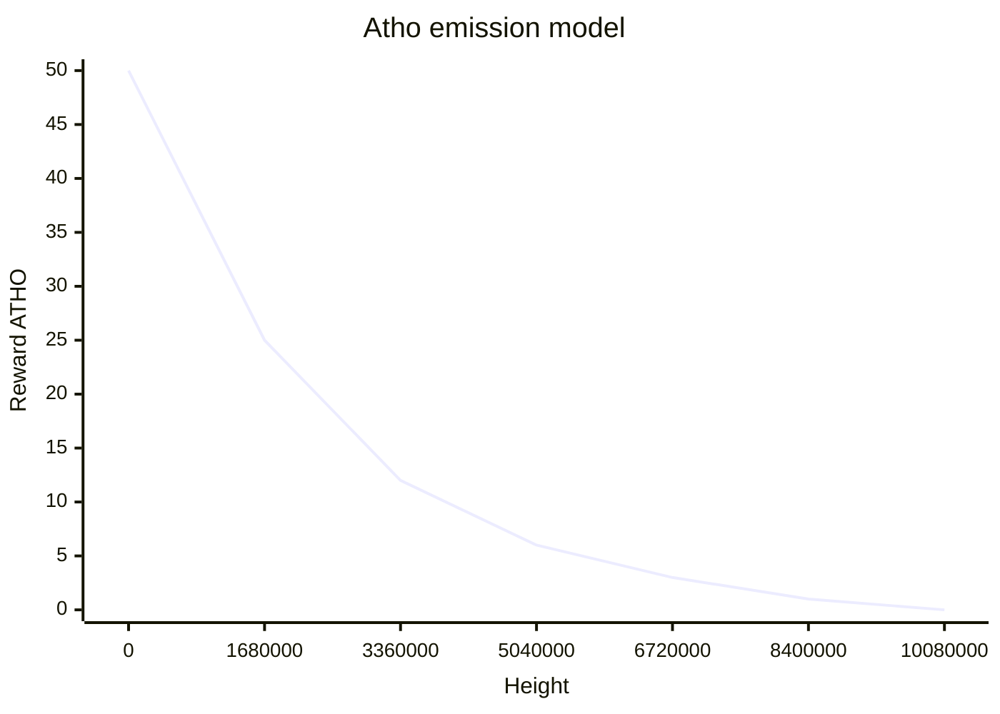

## Figure 7. Mempool Admission Flow

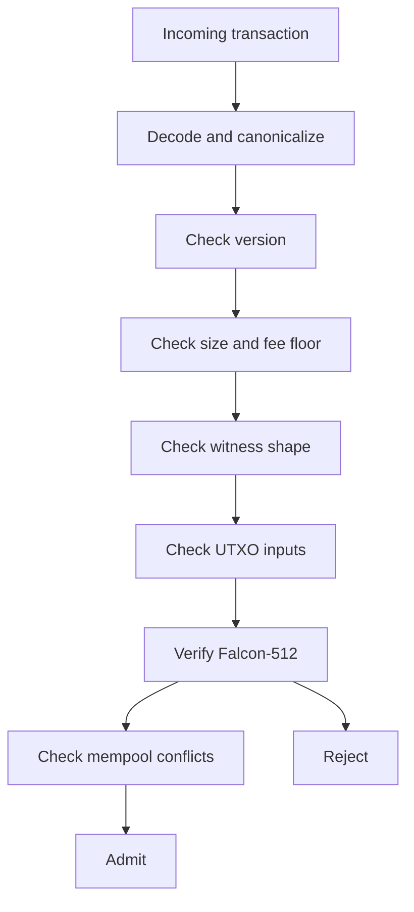

## Figure 8. Node Sync and Block Propagation Flow

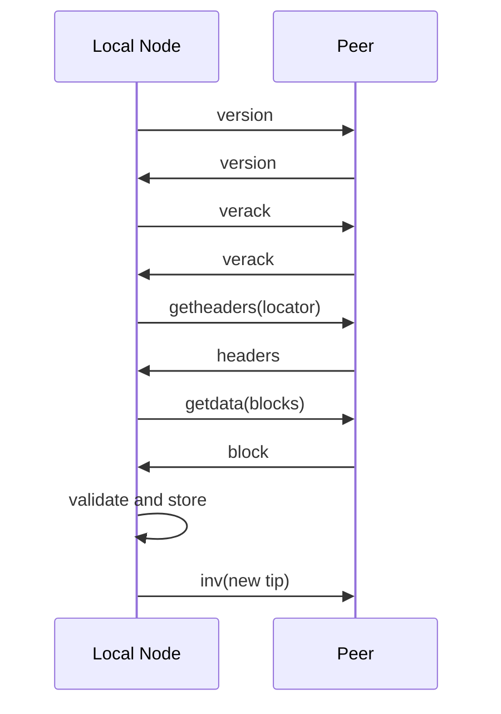

## Figure 9. Wallet-to-Node Interaction

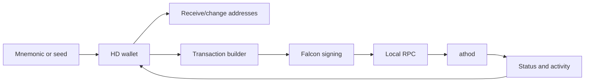

## Figure 10. Validation Pipeline and Parallel Work Distribution

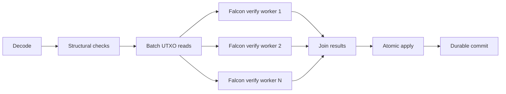

## Figure 11. Hybrid Storage Commit Model

```mermaid
flowchart TD
    Validated[Validated block] --> Serialize[Serialize canonical block bytes]
    Serialize --> Rotate{Current blk file has space?}
    Rotate -->|Yes| Append[Append [magic][length][raw block] to blkNNNN.dat]
    Rotate -->|No| NextFile[Rotate to next 128 MiB block file]
    NextFile --> Append
    Append --> Pointer[Record file number, offset, and payload length]
    Pointer --> Begin[Begin LMDB write transaction]
    Begin --> Meta[Write block metadata and height index]
    Meta --> Txs[Write transaction archive and tx index]
    Txs --> Snapshot[Write chainstate snapshot]
    Snapshot --> UTXO[Rewrite UTXO dataset]
    UTXO --> Commit[Commit LMDB transaction]
```
