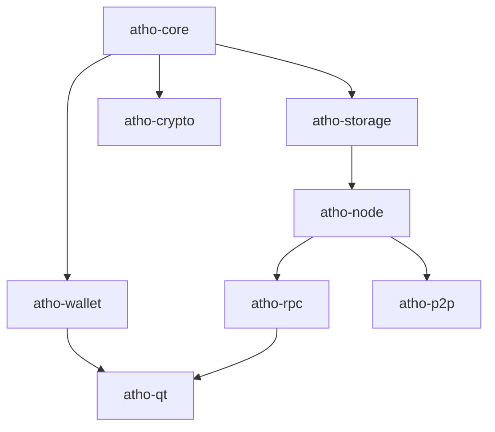
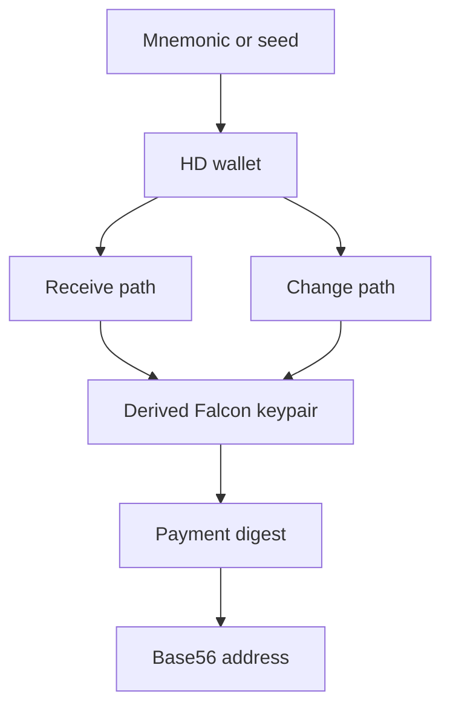
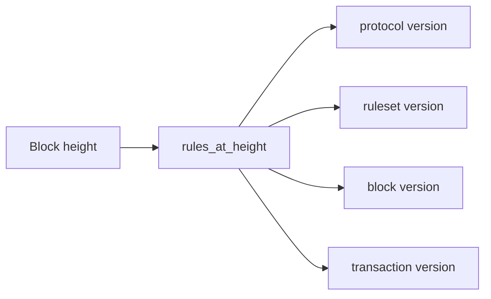

# Atho: A Bitcoin-Style Rust Payment Stack With Explicit Consensus, Post-Quantum Signatures, and Thin-Client Operation

**Author:** Atho Project  
**Repository Date:** April 28, 2026  
**Document Type:** Technical Whitepaper  

## Abstract

Atho is a from-scratch Rust blockchain payment stack that applies Bitcoin-style software discipline to a modern, explicitly documented implementation. The system uses a public UTXO ledger, local full validation, proof-of-work chain selection, explicit versioning, and a thin desktop client that follows backend state through a local RPC boundary. Atho differentiates itself through its use of SHA3-based hashing, Falcon-512 signatures, Base56 addresses, and a repository architecture that emphasizes a small trusted core and explicit state transitions. This whitepaper describes Atho’s current architecture, protocol design, wallet and storage model, network-layer foundations, versioning approach, current implementation status, and the remaining work required before production deployment. The paper argues that Atho’s strongest path is not feature breadth at Layer 1 but a compact, auditable, boring core whose local correctness can be demonstrated before public-network expansion.

**Keywords:** blockchain, UTXO, Rust, proof of work, Falcon, SHA3, thin client, deterministic validation

## Introduction

Many blockchain software stacks become difficult to audit because they grow through convenience-driven layering rather than through disciplined boundary setting. Atho is an attempt to move in the opposite direction. The project starts from a narrow payment-chain objective and tries to preserve the software lessons that made Bitcoin Core understandable: a small trusted core, explicit constants, deterministic validation, backend-owned truth, and minimal alternate paths. Atho does not duplicate Bitcoin mechanically. Instead, it adopts the same engineering posture while choosing different cryptographic and implementation primitives where that is appropriate for the project.

## Problem Statement

The problem Atho addresses is not “how to maximize Layer 1 feature count.” The problem is how to build a compact blockchain payment stack that can be reasoned about end to end. This requires answering several practical questions:

- How should chain validity be defined so that local nodes always own the final truth?
- How can wallet and GUI behavior stay thin enough to avoid forking logic away from the backend?
- How can future upgrades be introduced without scattering activation logic across the codebase?
- How can a network layer be added without weakening the integrity of the local core?

## Project Overview

Atho is organized as a Rust workspace with dedicated crates for protocol rules, storage, wallet logic, networking, RPC, runtime orchestration, and the desktop client. This structure is not decorative. It enforces subsystem ownership and keeps consensus-critical code away from UI and operational scaffolding.

The repository now centralizes all documentation under `docs/`, leaving the root `README.md` as the only Markdown file at repo root. This is part of the same philosophy: the project should have one obvious front door and one obvious documentation system.

## Architecture

### Core Protocol Layer

The protocol layer defines blocks, transactions, addresses, hashes, genesis data, consensus constants, and version rules. It is implemented primarily in `atho-core`. These objects are intended to be canonical and deterministic. For example, the block header explicitly includes the network identifier, height, previous hash, merkle root, witness root, timestamp, target, and nonce. Transactions explicitly encode version, inputs, outputs, lock time, and witness bytes.

### Storage and Validation Layer

The storage layer, implemented in `atho-storage`, owns both durable local truth and canonical contextual validation. Atho uses one LMDB environment per network with named databases for metadata, blocks, transactions, UTXOs, peers, and addresses. Accepted blocks are committed atomically with the chainstate snapshot and UTXO dataset, which reduces the risk of partial-write ambiguity during normal operation.

### Runtime and Client Boundary

The node runtime, implemented in `atho-node`, owns live chainstate, mempool, mining, orchestration, and mutable RPC handling. The desktop client, implemented in `atho-qt`, is intentionally thin. It does not validate blocks, own chainstate, or define consensus. Instead, it uses RPC status and request paths to track balances, tip height, mempool state, and wallet-oriented workflows. This design was chosen to reduce the chance that the GUI drifts into a second blockchain implementation.

## Protocol Design

### Network Identity

Atho currently supports mainnet, testnet, and regnet. Each network has a hardcoded genesis block, a unique wire magic value, a consensus identifier, dedicated ports, and a visible address prefix. This makes network identity part of the protocol surface instead of an out-of-band deployment detail.

### Transaction Model

Transactions spend explicit UTXOs and create new outputs in integer-denominated atoms. Current validation enforces non-zero outputs, duplicate-input rejection, fee floors, maturity rules, and Falcon witness verification. Signing uses the `ATHO_TX_SIG_V1` domain over a SHA3-384 digest of the canonical base transaction representation. This separation between txid generation and signing digest generation is deliberate; ambiguous signing rules are a recurring source of fragility in blockchain implementations.

### Block Model

Blocks commit to both a transaction merkle root and a witness root. The witness-root owner is the block header, not a duplicated side field. That decision simplifies reasoning about block commitment state and removes a historical source of redundant truth. Blocks are only accepted after contextual validation reruns the relevant checks, including reward bounds, fee totals, merkle root, witness root, target, proof of work, and UTXO transitions.

### Consensus and Emission

The current monetary constants are explicit: one Atho equals 100,000,000 atoms, the maximum supply is 168,000,000 Atho, the initial subsidy is 50 Atho, the halving interval is 1,680,000 blocks, and coinbase maturity is 150 blocks. Block time is targeted at 75 seconds. Difficulty uses a bounded retarget model built around recent history windows and median-style timestamp handling. The guiding principle is that consensus constants should be inspectable in code and in documentation without reverse engineering from runtime behavior.

## Wallet and Address System

Atho wallets are deterministic HD wallets with separate receive and change paths. The wallet crate manages mnemonic restoration, keypool refill, address-book state, and encrypted datafiles. Addresses use a Base56 format with visible network prefixes and checksums. The address design was chosen for explicit network differentiation and reduced human ambiguity rather than for compatibility with legacy Bitcoin encoding.

## Cryptographic Design

Atho uses SHA3-256 and SHA3-384 for different protocol roles and Falcon-512 as the active signature scheme. Domain separation labels are frozen in code for transaction, block-reserved, wallet-local, package, and test contexts. This structure is important because cryptographic ambiguity often enters a system not through the primitive itself but through overloaded reuse of the same primitive across different message families.

## Node and Runtime Model

The node composes storage, mempool, miner, sync state, and RPC-facing service ownership. The runtime is designed so that accepted transactions and blocks immediately refresh the backend status model consumed by the client. This is a practical product requirement as much as an architectural one: a correct backend that leaves the GUI stale still fails user trust.

## Network and Synchronization Model

Atho’s network layer currently provides a real message and session foundation: framed messages, protocol versioning, handshake rules, peer/session management, address gossip, inventory relay, and headers-first synchronization scaffolding. DNS seeds are intentionally blank. This is not an omission disguised as completeness. It is a decision to leave peer bootstrap empty until the live TCP peer runtime is hardened enough to justify public-network behavior.

## Versioning and Upgrade Model

Atho includes explicit protocol, ruleset, block, transaction, and storage schema versions. Rules are selected by height through a centralized activation registry. A placeholder V2 ruleset exists but is intentionally inactive. This scaffolding is important because it prevents future changes from becoming silent validator drift. However, the presence of scaffolding alone does not prove upgrade readiness. A real post-V1 activation still needs to be executed and tested.

## Reorg, Fork, and Pruning Handling

Branch selection uses accumulated chainwork rather than height alone. On a preferred branch, the chainstate disconnects the old suffix, applies the new suffix, and restores the previous chain if any candidate block fails during transition. This is the right shape for local correctness. Pruning support exists in bounded form, but the deep pruned-history lifecycle is not yet as mature as the main unpruned path.

## Implementation Status

As of the latest documented hardening pass, Atho’s local consensus, mining, replay, and Qt synchronization paths are meaningfully exercised. The repository includes lifecycle tests that mine real blocks, submit real transactions, restart the system, and verify that the Qt client follows the backend tip through RPC. Adversarial mutation campaigns have run cleanly in the documented pass set. However, the entire product is not yet production-ready.

The strongest implemented areas are:

- local validation determinism
- atomic local storage commits
- restart and recovery handling
- backend-owned tip synchronization for the Qt client

The weakest unfinished areas are:

- live TCP peer runtime completeness
- compact block and downloader functionality
- pruning and snapshot lifecycle coverage
- schema migration tooling
- canonical wallet history sourcing

## Production-Readiness Discussion

Atho is close enough to production shape that architectural discipline matters more now than raw feature accumulation. That means the next gains should come from finishing the real peer runtime, replacing indirect wallet-history reconstruction, and hardening remaining lifecycle gaps rather than from adding speculative Layer 1 features. The repository should continue to prefer compactness over expansion and explicitness over convenience-driven indirection.

## Conclusion

Atho’s strongest launch path is still the simplest one: a Bitcoin-style public UTXO payment chain with explicit consensus, local full validation, a small trusted core, and a thin client boundary. The current codebase already reflects much of that discipline, especially in the local consensus and storage path. What remains is not conceptual reinvention. It is the practical completion of network runtime, lifecycle, and operator-facing hardening. If the project continues to treat documentation, validation, and restart correctness as first-class concerns, it can move toward a credible production-grade payment stack without sacrificing auditability.

## References

Atho Project. (2026a). *Atho documentation index* [Internal project documentation]. `docs/index.md`

Atho Project. (2026b). *Atho source code workspace* [Internal software repository]. `crates/`

Atho Project. (2026c). *Current production status* [Internal project documentation]. `docs/production-readiness/current-status.md`

Nakamoto, S. (2008). *Bitcoin: A peer-to-peer electronic cash system*.

Pornin, T. (n.d.). *FN-DSA (in Rust)* [Vendor documentation]. `docs/reference/vendor/fn-dsa-rust-readme.md`
